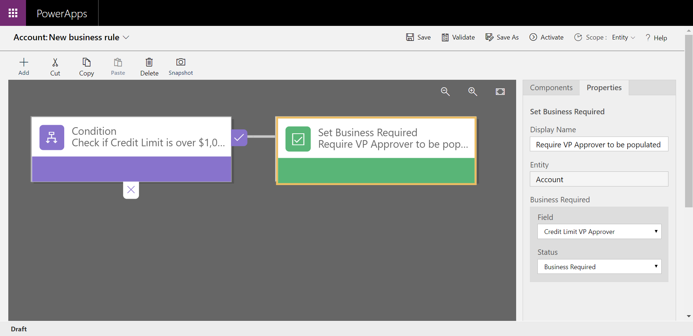
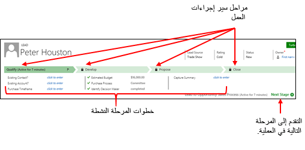
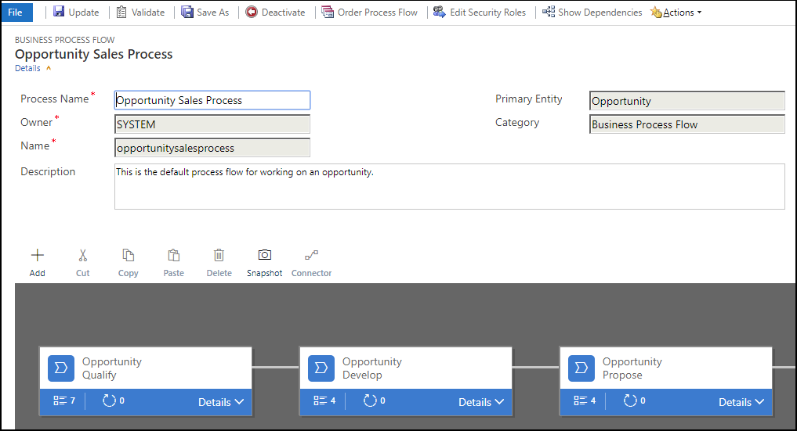

يساعد Microsoft Power Platform المؤسسات على تحسين عملياتها من خلال أتمتة المهام الروتينية وتوحيد أفضل الممارسات. يعد إظهار هذه الأتمتة لمؤسسة طريقة سهلة لإظهار كيف يمكن للمؤسسة أن تصبح أكثر كفاءة باستخدام تطبيق يستند إلى نموذج. هناك ثلاثة أنواع رئيسية من الأتمتة التي تستخدمها التطبيقات المستندة إلى نموذج: قواعد العمل، وتدفق إجراءات العمل، وتدفقات Microsoft Power Automate. في هذه الوحدة، سنتعلم المزيد حول كيفية تكوين كل نوع من أنواع الأتمتة. 

قواعد العمل
--------------

في Microsoft Dataverse، يمكنك تحديد قواعد العمل. تسمح لك قواعد العمل بتطبيق منطق الأعمال والحفاظ عليه في طبقة البيانات بدلاً من طبقة التطبيق. بعبارة أكثر بساطة، إذا قمت بإنشاء قواعد عمل في Dataverse، فستكون سارية بغض النظر عن كيفية تفاعلك مع البيانات.
مثال على استخدام قواعد العمل هو عندما تكون في لوحة الرسم أو التطبيقات المستندة إلى نموذج لتعيين القيم أو مسحها في حقل واحد أو أكثر في كيان ما. يمكن استخدامها أيضًا للتحقق من صحة البيانات المخزّنة أو إظهار رسائل الخطأ. يمكن للتطبيقات المستندة إلى النماذج استخدام قواعد العمل لإظهار الحقول أو إخفائها، وتمكين الحقول أو تعطيلها، وإنشاء توصيات بناءً على ذكاء الأعمال.

يمكن إنشاء قواعد العمل باستخدام مصمم قواعد العمل البسيط، حيث يمكنك سحب المربعات وإسقاطها لتمثيل الشروط والنتائج المختلفة لقاعدة عملك. في المثال أدناه، أنشأنا قاعدة عمل للتحقق من حقل يسمى **حد الائتمان**. إذا تجاوز حد الائتمان للسجل مبلغًا معينًا، فسيصبح حقل آخر يسمى **VP Approver** مطلوبًا بدلاً من اختياري. تفي قاعدة العمل هذه بمتطلبات العمل حيث تتطلب حدود الائتمان الكبيرة موافقة إضافية.

> 

عمليات سير إجراءات العمل
-------------------

سيساعد تكوين سير إجراءات العمل في تحديد مجموعة من الخطوات التي يجب على الأشخاص اتباعها لنقلهم إلى النتيجة المرجوة. توفر هذه الخطوات مؤشرًا مرئيًا يخبر الأشخاص بمكانهم في عملية الأعمال. تقلل عمليات سير إجراءات العمل من الحاجة إلى التدريب لأن المستخدمين الجدد ليسوا مضطرين للتركيز على الكيان الذي يجب أن يستخدموه.

> 

يمكنك تكوين تدفقات إجراءات العمل لدعم المبيعات الشائعة أو منهجيات العمليات. باستخدام مصمم سير إجراءات العمل، يمكنك إنشاء سير إجراءات عمل مخصص لمطابقة عمليات الأعمال الفريدة لمؤسستك.

> 

قم بتكوين سير إجراءات العمل باتباع الخطوات أدناه.

1.  في جزء التنقل الأيسر، حدد **العمليات**.

2.  في شريط الأدوات **الإجراءات**، حدد **جديد**.

3.  في مربع الحوار **إنشاء عملية**، أكمل الحقول المطلوبة:

    -   أدخل اسم العملية. رغم أنه يجب أن يكون اسم العملية ذا معنى للأشخاص الذين يحتاجون إلى اختيار العملية، لا يلزم أن يكون اسم العملية فريدًا. يمكنك تغيير ذلك في وقت لاحق.

    -   في القائمة **الفئة**، حدد **سير إجراءات العمل**.

    -   لا يمكنك تغيير الفئة بعد إنشاء العملية.

    -   في القائمة **الكيان**، حدد الكيان الذي تريد أن تبني العملية عليه.

4.  حدد **موافق**. يتم إنشاء العملية الجديدة، ويفتح مصمم "سير إجراءات الأعمال" بمرحلة واحدة تم إنشاؤها بالفعل من أجلك.

5.  أضف مراحل.

6.  أضف خطوات إلى إحدى المراحل.

7.  أضف فرعًا (أو شرطًا) إلى العملية إذا لزم الأمر.

8.  لتنشيط العملية وإتاحتها لفريقك، حدد "تنشيط".

