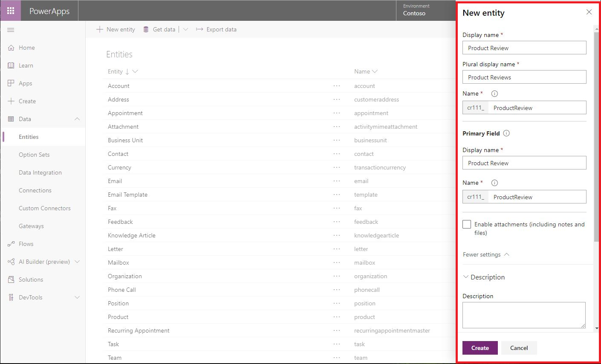

تم تصميم نموذج البيانات المشتركة لتغطية سيناريوهات الأعمال الأكثر شيوعاً، ولكن قد يكون لدى المؤسسات مفاهيم وعمليات محددة لا يمكن لنموذج البيانات المشتركة تفسيرها. في هذه المواقف، يمكنك إنشاء **كيان مخصص** لتوسيع الوظائف الجاهزة بسهولة.

### الأهداف التعليمية
في نهاية هذا التمرين، ستكون قد أنشأت كياناً مخصصاً جديداً لـ Contoso البحث.

### الخطوات عالية المستوى
1. قم بالوصول إلى Power Platform مركز الإدارة.
2. انتقل إلى الكيانات.
3. إنشاء كيان مخصص جديد.
4. تكوين الإعدادات للكيان الجديد.

### الخطوات التفصيلية 
تحتاج إلى إظهار **بحث Contoso** كيف يمكن توسيع التطبيقات المستندة إلى نموذج Dynamics 365 بسهولة. قررت إنشاء كيان جديد يسمى **مجموعة التركيز** لتوضح لهم كيفية تتبع المجموعات المركزة التي يجندون إليها وتسهيلها. 

1.  قم بتسجيل الدخول إلى Power Platform مركز الإدارة.

2.  في جزء التنقل، انقر أو اضغط على **بيانات**، ثم انقر أو اضغط على **الكيانات**.

3.  في شريط الأوامر، انقر أو اضغط على **كيان جديد**. قبل إنشاء كيان، تأكد من تأكيد عدم وجود كيان قياسي يناسب احتياجاتك.

4.  في لوحة **كيان جديد** قم بما يلي:

    - في المربع **اسم العرض** أدخل **مجموعة التركيز**.

5. لاحظ أن المربعات التالية يتم ملؤها تلقائياً أثناء إدخال اسم العرض:

    -   **اسم العرض الجماعي** - تتم تعبئة هذا المربع تلقائياً عند إدخال اسم عرض، ولكن يمكنك تغييره إذا لزم الأمر. اسم العرض الجمع هو اسم الكيان في Microsoft Dataverse ويستخدم عند التفاعل مع هذا الكيان من أو دفق Power Apps.

    -   **الاسم** - يتم أيضاً ملء هذا المربع تلقائياً عند إدخال اسم عرض. تم إعداد البادئة عندما تم إنشاء البيئة وتضمن إمكانية تصدير الكيانات التي تقوم بإنشائها واستيرادها إلى بيئات أخرى دون التعارض مع أسماء الكيانات الأخرى. يمكنك تغيير هذه البادئة عن طريق تحديث البادئة على الناشر الخاص بك لحل Dataverse الافتراضي. لمنع تعطل التطبيقات الحالية، لا يمكنك تغيير الاسم بعد حفظ الكيان.

6. في قسم **الحقل الأساسي** في مربع **اسم العرض**، استبدل  **الاسم** من **مجموعة التركيز**. يتم استخدام هذا الحقل بواسطة حقول البحث عند إنشاء علاقات مع الكيانات الأخرى. 

7. افتح قسم **المزيد من الإعدادات** وقم بتوسيع **الوصف**. يمكنك إدخال وصف للكيان الخاص بك إذا كنت ترغب في ذلك (الأوصاف مفيدة إذا كان الأشخاص الآخرون سيستخدمون هذا الكيان).

8. حدد خيار الكيان **النشاط** > من القائمة المنسدلة **حدد نوع الكيان**  لتمكين الكيان كنشاط.

9. وسّع **إنشاء الإعدادات وتحديثها** وحدد خانة الاختيار **تمكين نماذج الإنشاء السريع**. يضمن هذا الخيار أنه يمكنك استخدام نموذج الإنشاء السريع لإنشاء سجل.

10.  عند الانتهاء، انقر فوق **إنشاء**.

    > [!div class="mx-imgBorder"]
    > 
