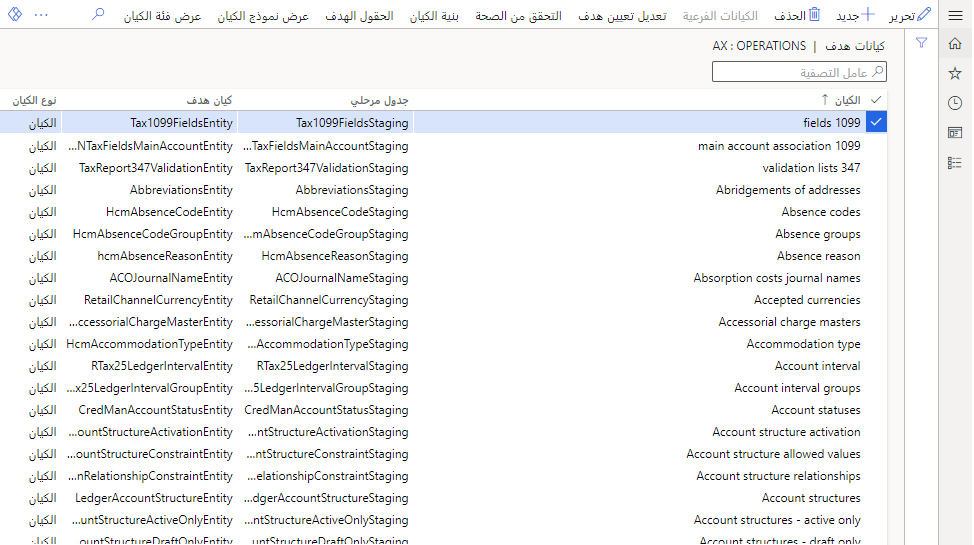
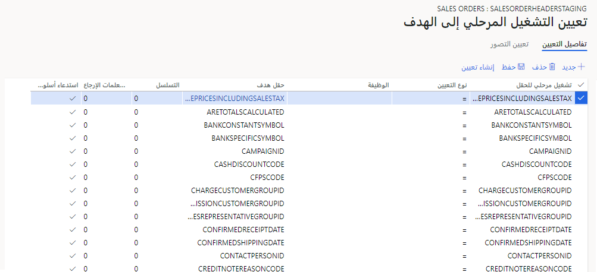
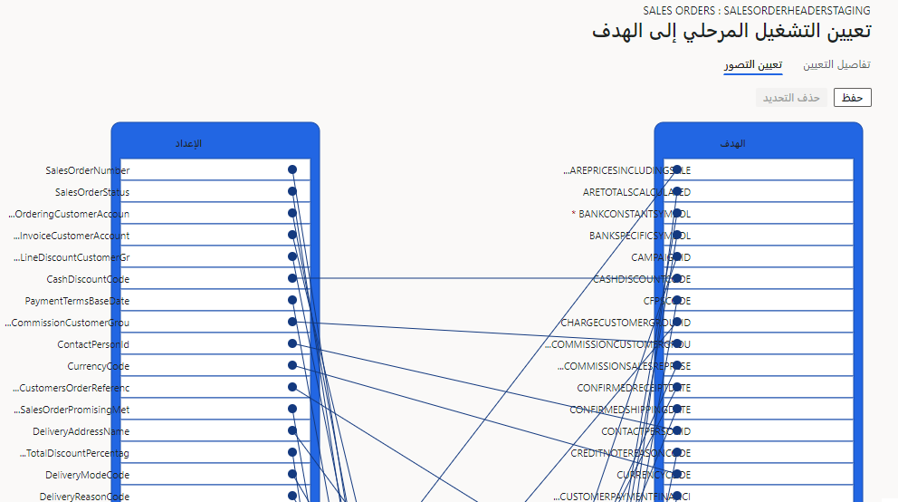

تعد إدارة البيانات مساحة عمل في تطبيقات التمويل والعمليات. وبالتالي، يمكننا تكوين الكيانات لاستخدامها للبيانات الواردة والصادرة. يمكننا أيضاً إعداد الوظائف، والتي ستقوم باستيراد البيانات أو تصديرها، إما لمرة واحدة أو على أساس منتظم. 

ظل إطار إدارة البيانات يتطور على مدى عدة سنوات. تم في البداية إنشاء عدة كيانات شائعة الاستخدام فقط. بينما كان المهندسون ينشئون المزيد من الكيانات لنا، فقد منحونا أيضاً إمكانية إنشاء كيانات خاصة بنا.

غالباً ما تكون البيانات في الأنظمة الخارجية غير طبيعية، بينما يعتمد Dynamics 365 على قاعدة بيانات طبيعية. نحتاج في كثير من الأحيان إلى تسوية بياناتنا لإرسالها، أو لتلقي البيانات المسطحة. يتكون كيان البيانات من جدول مرتبط واحد أو أكثر. مثلاً، يشتمل رأس أمر المبيعات وبنود المبيعات على كيان مركّب.

تستخدم Dynamics بشكل اختياري جداول مرحلية حتى نتمكن من التحقق من صحتها قبل وضع البيانات في قاعدة البيانات الخاصة بنا، أو قبل إرسالها خارجياً.

من السهل إنشاء كيان بيانات، على الرغم من وجود عدة آلاف منها، فغالباً ما يتم ذلك باستخدام الجداول المخصصة.

نقوم في أغلب الأحيان بتعديل كيان موجود لإضافة حقل. يمكنك القيام بهذه المهمة في مساحة العمل **إدارة البيانات** بتحديد الإطار المتجانب **كيانات البيانات**.
يتم تحديث قائمة الكيانات بشكل دوري، وقد يتم إخطارك بضرورة ذلك.
يمكنك إنشاء كيان بيانات جديد من الشاشة التالية.

> [!div class="mx-imgBorder"]
> 

سنشاهد ما يلي:

-   اسم الكيان

-   جدول مرحلي

-   الكيان الهدف

-   نوع الكيان - قد يكون كياناً أو كياناً مركباً

-   تتبع التغيير - يمكننا تعيين كيان لاكتشاف السجلات التي تم تغييرها وإرسالها

-   النوع – الاستعلام الأساسي

-   المعالجة المستندة إلى المجموعة - تكون عملية الاستناد إلى المجموعة أسرع ولكنها تفتقد إلى بعض منطق الأعمال

-   مفتاح التكوين - يمكن تعيينه للأمان

يمكنك رؤية الحقول الفردية في الكيان وتعييناتها، من التدريج إلى الهدف، إذا قمت بتمييز كيان وحدد تعديل تعيين الهدف.

> [!div class="mx-imgBorder"]
> 

سترى هذه الخيارات على وجه التحديد في علامة التبويب "تفاصيل التعيين":

-   تشغيل مرحلي للحقل

-   نوع التعيين:

    | **النوع** | **ماذا تفعل** |
    |----------|------------------|
    | =        | الإعداد          |
    | ()       | الدالة         |

-   اسم الدالة (إذا تم تحديدها لاحقاً)

-   الحقل الهدف

-   التسلسل - يجب غالباً إدخال الحقول بترتيب معين

-   تسلسل معلمات الإرجاع

-   خانة اختيار طريقة التحقق من صحة المكالمة - إذا كان التحقق من الصحة ضرورياً. اعلم أننا نتأثر بالأداء لعمليات الترحيل الكبيرة

يمكنك أيضاً التبديل إلى علامة تبويب "رسم الخرائط" ومشاهدة تعيين الحقول الموصوفة بيانياً. الحقول على الجانبين، وهناك خطوط بين الاثنين. يشار إلى الحقول المطلوبة بعلامة النجمة. التغييرات هنا سهلة مثل رسم خط بالماوس.

> [!div class="mx-imgBorder"]
> 

لمزيد من الدراسة حول هذا الموضوع، جرب: [العمل مع إدارة البيانات في تطبيقات التمويل والعمليات](/training/modules/work-data-management-finance-operations/)
