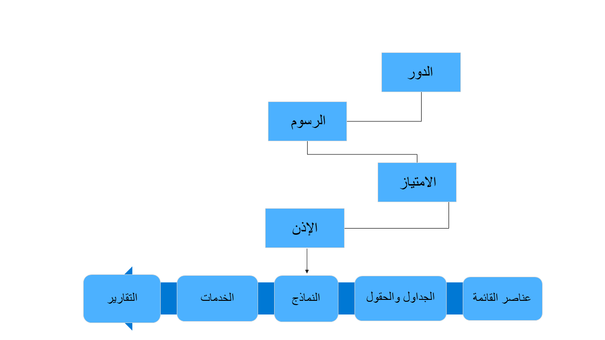
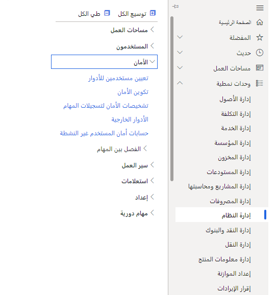
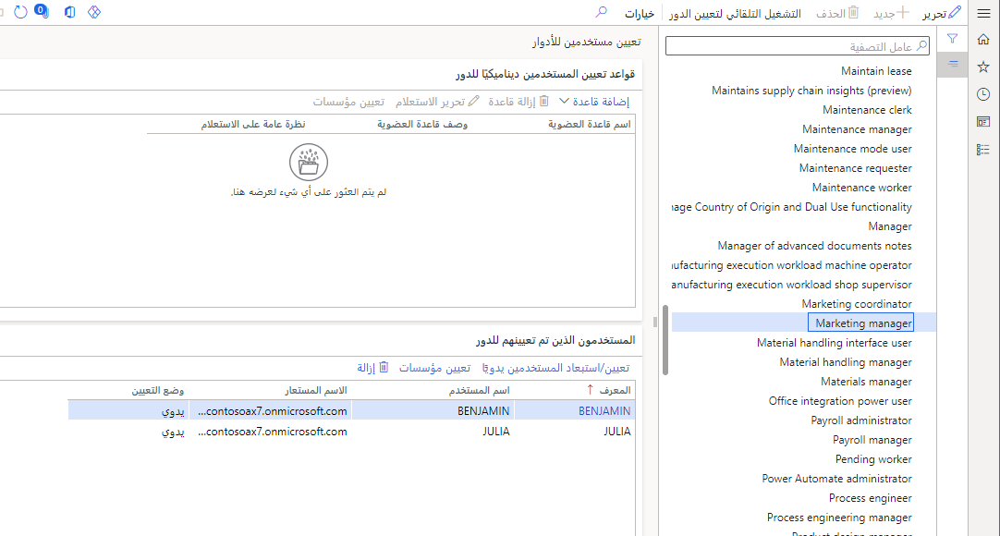
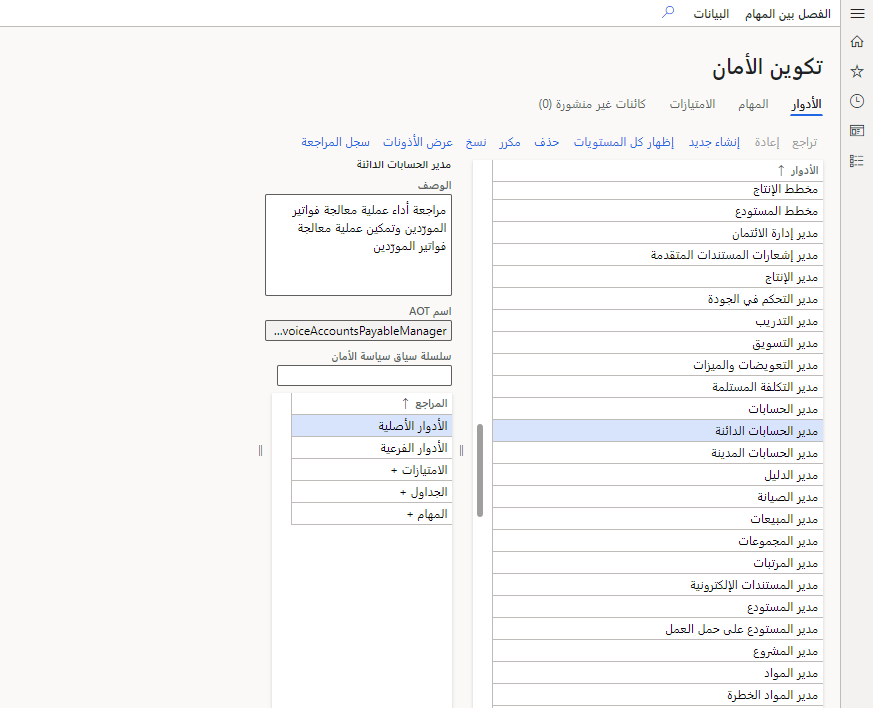
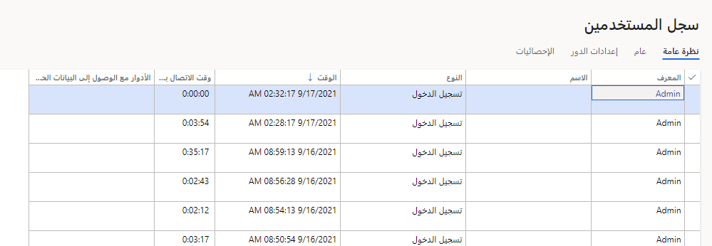

ستساعد معرفة كيفية تنفيذ الأمان بشكل صحيح بمساعدة الشركات على تغطية متطلباتها الأمنية. قد تكون هذه المتطلبات قانونية أو تنظيمية أو تجارية. يقوم Dynamics تلقائياً بإخفاء البيانات والنماذج وغيرها التي لا يملك المستخدم حق الوصول إليها.

تنفذ تطبيقات التمويل والعمليات الأمان المستند إلى الأدوار - ما يراه الشخص يعتمد على الأدوار الوظيفية التي تم تعيينها له. يتكون الدور من واجبات، لها امتيازات، وتحتوي على أذونات أكثر دقة.
انظر الرسم البياني أدناه للحصول على تصوير:

> [!div class="mx-imgBorder"]
> 

قد يتم تعيين المستخدمين لأدوار في إدارة النظام، والأمان، وتعيين المستخدمين إلى الأدوار.

إدارة النظام الأمان تعيين المستخدمين إلى الأدوار.

> [!div class="mx-imgBorder"]
> 

تُظهر الشاشة الناتجة جميع الأدوار في النظام على الجانب الأيسر. إذا قمت بتمييز دور ما، فيمكنك رؤية المستخدمين المعينين لهذا الدور. يمكنك أيضاً إنشاء قاعدة لتعيين الدور تلقائياً، بحيث لا يحتاج المسؤول إلى التدخل يدوياً مع كل تغيير في الدور.

> [!div class="mx-imgBorder"]
> 

لتغيير امتيازات دور ما، انتقل إلى "إدارة النظام"، و"الأمان"، و"تكوين الأمان".

> [!div class="mx-imgBorder"]
> 

يوجد قدر كبير من المرونة هنا لإضافة الأمان وإزالته: على سبيل المثال، واجبات إلى دور. للإضافة أو الإزالة بحسب الحاجة، من السهل تحديد دور والانتقال لأسفل للوصول إلى امتيازات هذا الدور.

تقدم علامة التبويب المهام الامتيازات والأدوار، وتتعلق علامة التبويب "الامتيازات" بأصناف القائمة والكيانات.

للتدقيق الأمني، انتقل إلى "إدارة النظام" و"الاستعلامات" و"سجل المستخدم".

> [!div class="mx-imgBorder"]
> 

يتوفر المزيد من المعلومات حول الأمان. نوصي بهذه الوحدات على Learn: [تخطيط الأمان وتنفيذه في تطبيقات التمويل والعمليات](/training/modules/plan-implement-security-finance-operations/) و[تنفيذ الأمان المستند إلى الأدوار في تطبيقات التمويل والعمليات](/training/modules/role-security-finance-operations/).
