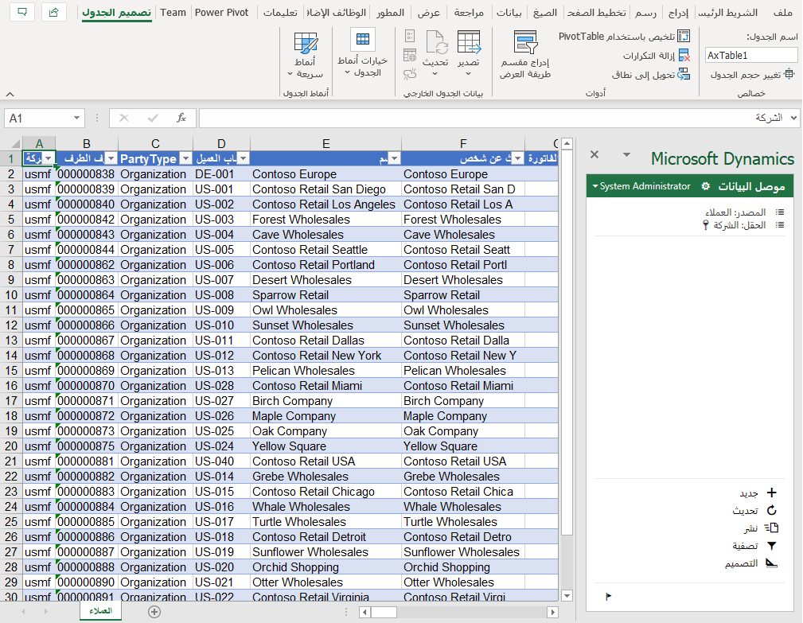

سنقوم بإجراء تغيير بسيط على سجل العميل في Excel، ونشره مرة أخرى في Dynamics.

1.  انتقل إلى **جميع العملاء** في قائمة **الحسابات المدينة**.

2.  في النماذج في Dynamics، سترى شعار Office مع خيار **تصدير إلى Excel** (وهو تصدير بسيط) أو، إذا كان الخيار متاحاً، إلى **فتح في Excel**، جنباً إلى جنب مع أي كيانات متاحة.

 > [!div class="mx-imgBorder"]
 > 

 > [!div class="mx-imgBorder"]
 > 

3.  **فتح في Excel** يتيح التحديثات. حدد ذلك واستكشف الخيارات المتاحة: تنزيل وحفظ في OneDrive وحفظه في SharePoint.

 > [!div class="mx-imgBorder"]
 > 

4.  قد تحتاج إلى الوثوق بالوظيفة الإضافية وتسجيل الدخول. سيتم بعد ذلك تقديم بياناتك (في الصورة أدناه، بيانات العملاء) في تنسيق جدول بيانات.

 > [!div class="mx-imgBorder"]
 > 

5.  غيّر حقلاً (على سبيل المثال، الاسم) وحدد **نشر**.

 > [!div class="mx-imgBorder"]
 > 

6.  ارجع إلى Dynamics وقم بتحديث شاشتك لمشاهدة التحديث:

 > [!div class="mx-imgBorder"]
 > 
