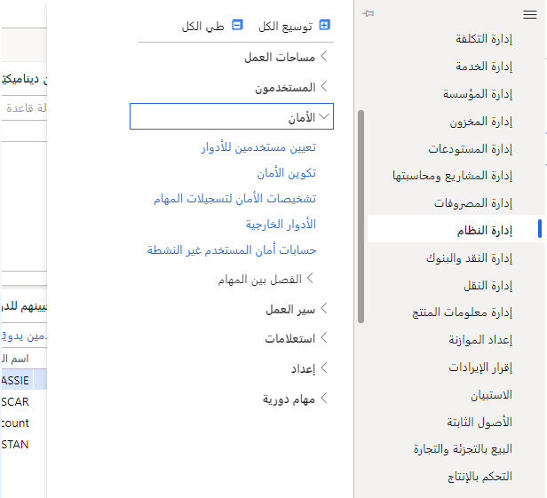
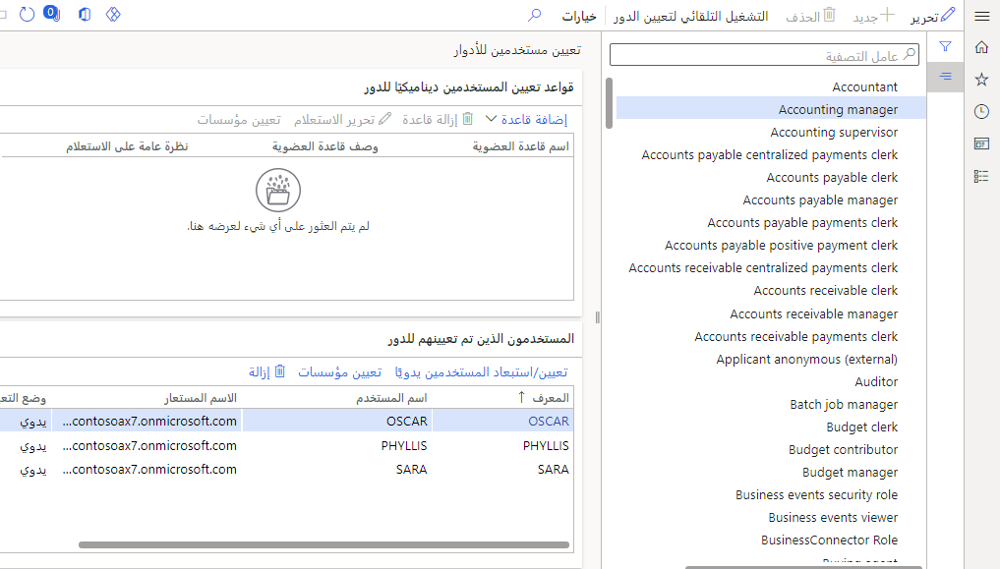
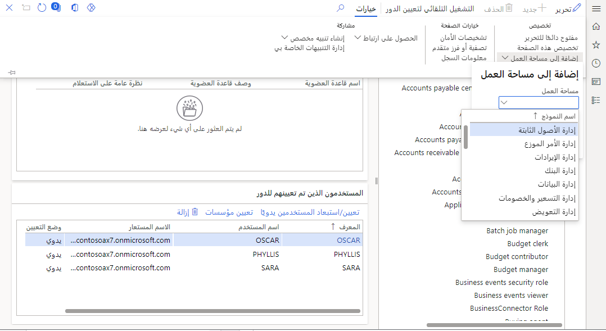

يتم تعيين لوحات معلومات للمستخدمين وفقاً لأدوارهم. إذا احتاج المستخدم إلى لوحة معلومات إضافية، فيمكن القيام بذلك بسهولة.

1.  انتقل إلى وحدة **إدارة النظام**، **الأمان**، **تعيين المستخدمين للأدوار**.

 > [!div class="mx-imgBorder"]
 > 

2.  حدد دور **مدير المحاسبة** ولاحظ الشخص الموجود فيه - أوسكار، في بيانات العرض التوضيحي.

 > [!div class="mx-imgBorder"]
 > 

3.  قم بتمييز أوسكار أو الشخص الذي حددته، وفي الجزء العلوي، يمكنك تحديد خيارات، تخصيص، إضافة إلى مساحة العمل.

4.  حدد مساحة العمل المطلوبة من القائمة المنسدلة وكيفية تقديمها (تجانب أو قائمة أو رابط).

 > [!div class="mx-imgBorder"]
 > 
