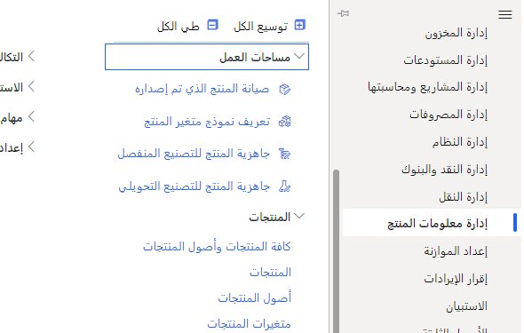
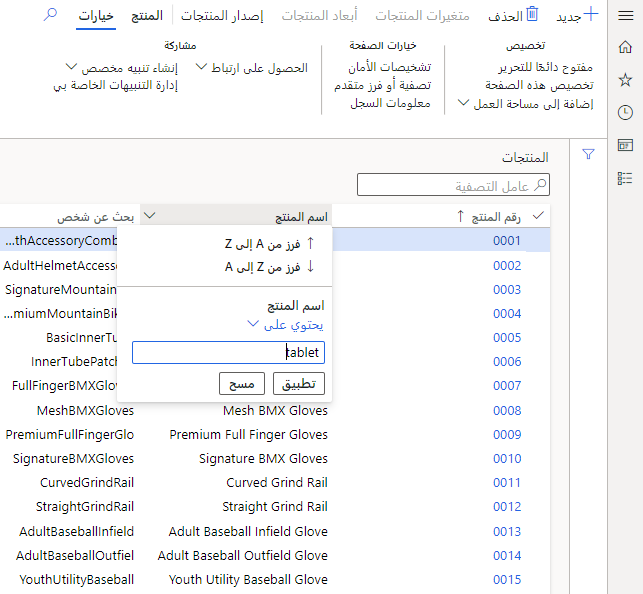
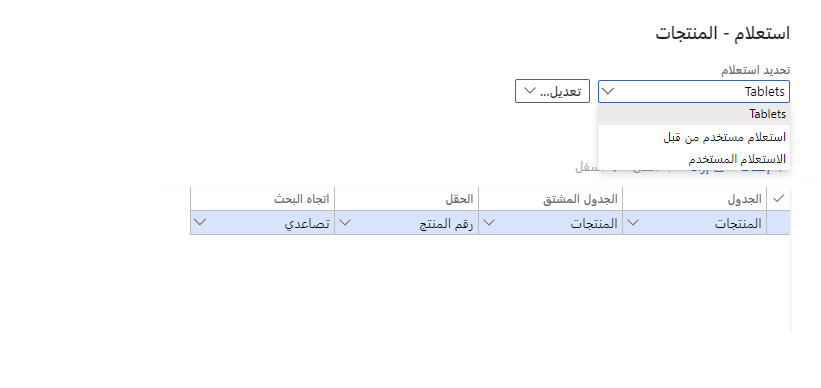

لنفترض أنك تنتقل كثيرًا إلى شاشة المنتجات، وعادةً ما تستخدم مجموعة فرعية صغيرة فقط من المنتجات. يمكنك إنشاء استعلام لعرض هذه المنتجات واستعلامات متعددة حسب الحاجة.

1.  انتقل إلى **وحدة إدارة معلومات المنتجات**، **المنتجات**، **جميع المنتجات وأصول المنتجات**.

 > [!div class="mx-imgBorder"]
 > 

2.  لنفترض أنك تعمل بشكل أساسي على أجهزة لوحية. حدد القائمة المنسدلة على يمين اسم المنتج في الشبكة، وستظهر لك المعايير. غيّر "يبدأ بـ" إلى "يحتوي على" واكتب الجهاز اللوحي في المربع.

 > [!div class="mx-imgBorder"]
 > 

3.  حدد تطبيق أو اضغط ببساطة على Enter وتأكد من استخدام عامل التصفية.

 > [!div class="mx-imgBorder"]
 > 

هذا رائع، لكنه جيد فقط للمثيل الحالي للنموذج. كيف تحفظه لاستخدامه في المستقبل؟

1.  حدد **الخيارات** و **التصفية المتقدمة أو فرز** ضمن **خيارات الصفحة**.

2.  أضف فرزًا مختلفًا بالانتقال إلى علامة التبويب الفرز وغيّر الحقل من رقم المنتج إلى اسم البحث.

3.  سيظهر لك فهرس؛ قبول.

4.  حدد تعديل وحفظ باسم. قم بتسمية استعلامك وحدد موافق.

5.  الآن، عندما تعود إلى النموذج، يمكنك الانتقال إلى الخيارات وتحديد استعلام الأجهزة اللوحية.

6.  أضف استفسارات إضافية للظروف المختلفة حسب الحاجة.

 > [!div class="mx-imgBorder"]
 > .
