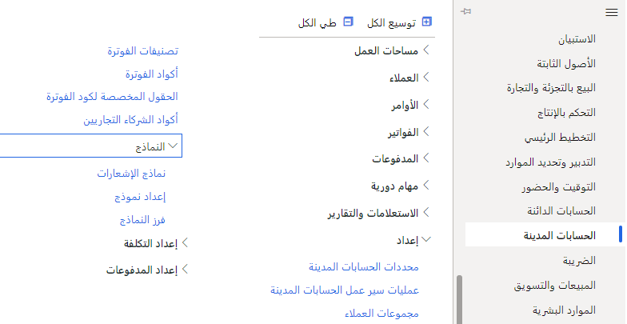
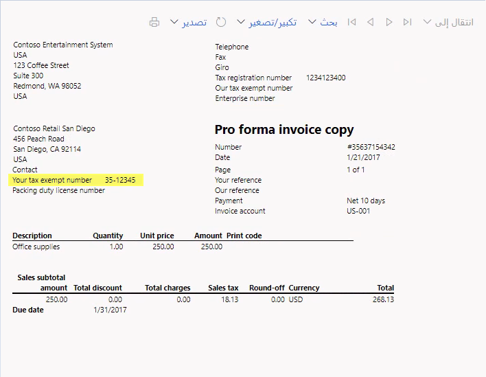

من السهل والسريع إجراء عدة أنواع من التغييرات الشائعة على التقارير الحالية.

1.  انتقل إلى الوحدة النمطية **حسابات المقبوضات**، ضمن **الإعداد** و **النماذج** وحدد **إعداد النموذج**.

 > [!div class="mx-imgBorder"]
 > 

2.  نظرًا لأنك في "الحسابات المقبوضة"، ستُعرض عليك خيارات لنماذج العملاء. إذا كنت في مكان آخر، فستحصل على نماذج ذات صلة بهذه الوحدة النمطية.

3.  انتقل إلى علامة التبويب "النص الحر للفاتورة"، وقم بتغيير "طباعة رقم الإعفاء الضريبي" على الفاتورة إلى "نعم".

4.  انتقل إلى وحدة "الحسابات المقبوضة"، ضمن "الفواتير"، وحدد "كل الفواتير ذات النص المجاني".

5.  قم بتمييز الفاتورة "لم يتم ترحيلها" وضمن "المستند"، حدد "عرض ونسخ".

6.  عندما يتم عرض نسخة الفاتورة، راجع "رقم الإعفاء الضريبي الخاص بك" في الفاتورة.

 > [!div class="mx-imgBorder"]
 > 

يمكن إجراء العديد من التخصيصات الأخرى عبر [إدارة مستندات الأعمال](/dynamics365/fin-ops-core/dev-itpro/analytics/er-business-document-management)، والتي تتيح التحرير السريع والسهل باستخدام القوالب.
