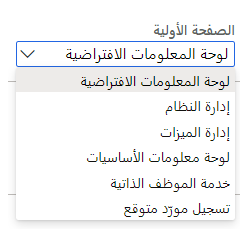
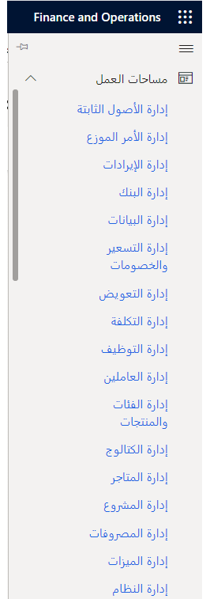

تختلف لوحات المعلومات التي يتم عرضها للمستخدم حسب إعدادات الأمان.
على وجه التحديد، يكون للدور المعين للمستخدم رأي في لوحات المعلومات الخاصة به.
ضمن الدور، يمكن للمستخدمين تعيين تفضيل في خيارات المستخدم للوحة المعلومات الأولية عند تسجيل الدخول.

> [!div class="mx-imgBorder"]
> 

تعتمد لوحات المعلومات المتاحة لك على دورك، وتوجد في قائمة مساحات العمل.

> [!div class="mx-imgBorder"]
> 
