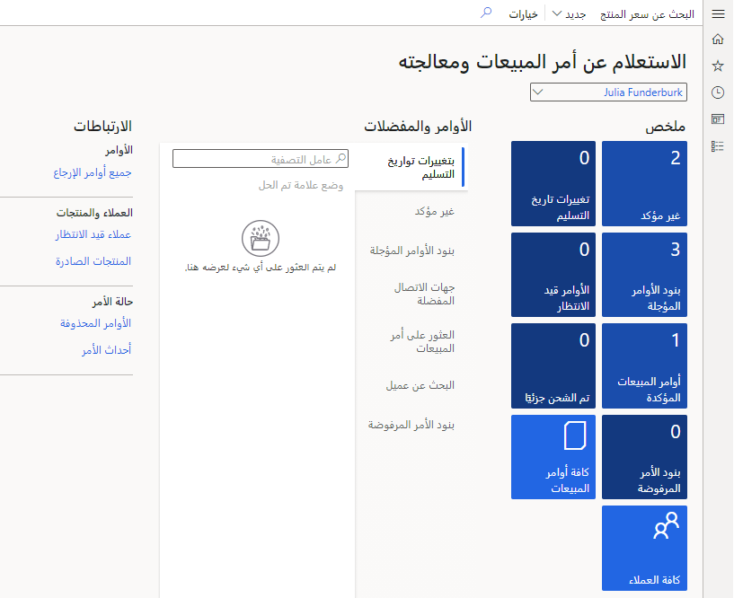
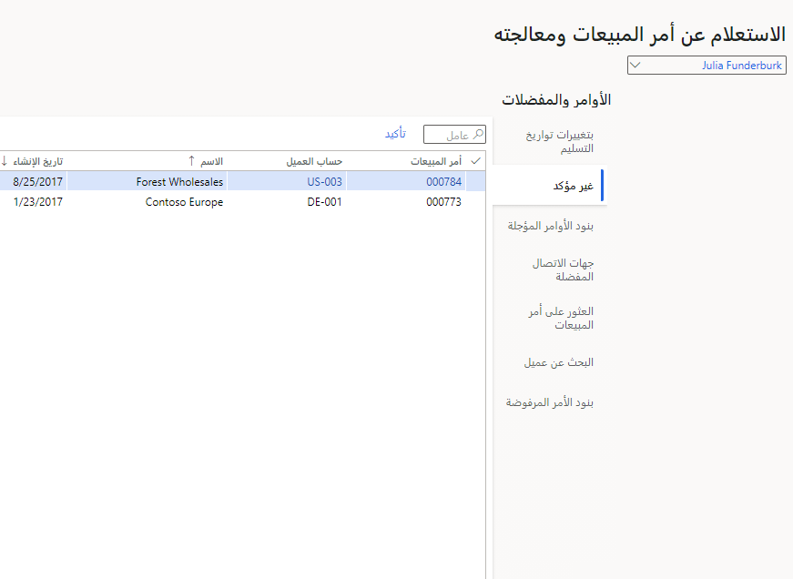
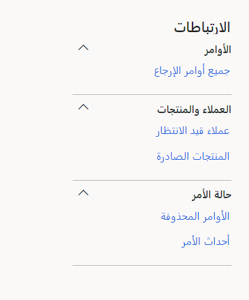
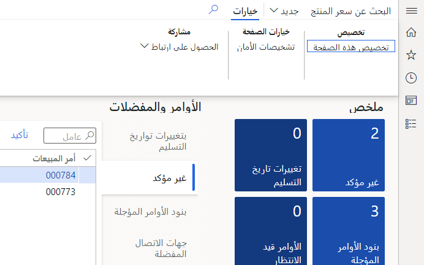
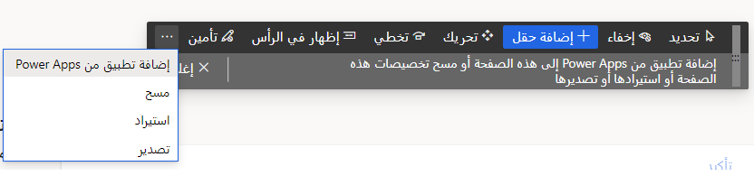
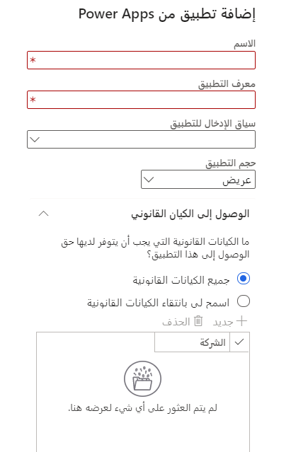

تستخدم Dynamics 365 Finance MicrosoftPower BI لاستكشاف البيانات. يتم توفير العديد من تطبيقات Power BI لك.

انتقل إلى مساحات العمل ومعالجة طلبات المبيعات والاستعلام عنها.

لاحظ المربعات ومؤشرات الأداء الرئيسية المتاحة لك. على سبيل المثال، في لقطة الشاشة أدناه، يوجد أمران مبيعات غير مؤكدين. إذا حددت هذا المربع، فسيتم نقلك إلى نموذج يعرض هذين الأمرين.

> [!div class="mx-imgBorder"]
> 

كل لوحة عبارة عن ارتباط سريع بالبيانات الأساسية التي تلخصها.

تعرض لوحة المعلومات أيضاً قوائم بها بيانات سريعة تحت العنوان **الطلبات والمفضلة**. يمكنك عرض هذه الطلبات غير المؤكدة نفسها هنا.

> [!div class="mx-imgBorder"]
> 

أخيراً، في أقصى اليمين، يمكنك رؤية قائمة مجموعة بالارتباطات.

> [!div class="mx-imgBorder"]
> 

يمكنك تخصيص لوحة القيادة أيضاً، إذا كنت قد كتبت تطبيق Power. حدد **خيارات** و **تخصيص هذا النموذج**.

> [!div class="mx-imgBorder"]
> 

يمكنك إخفاء أجزاء من النموذج وإضافة حقول وإضافة PowerApp.

> [!div class="mx-imgBorder"]
> 

بالنسبة لـ PowerApp، تتوفر العديد من الخيارات - الاسم وبيانات الإدخال والحجم والكيانات القانونية التي يسحب البيانات منها.

> [!div class="mx-imgBorder"]
> 
