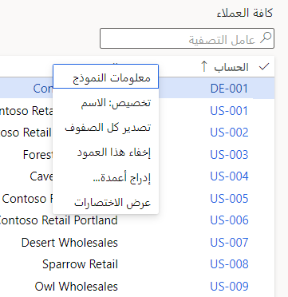
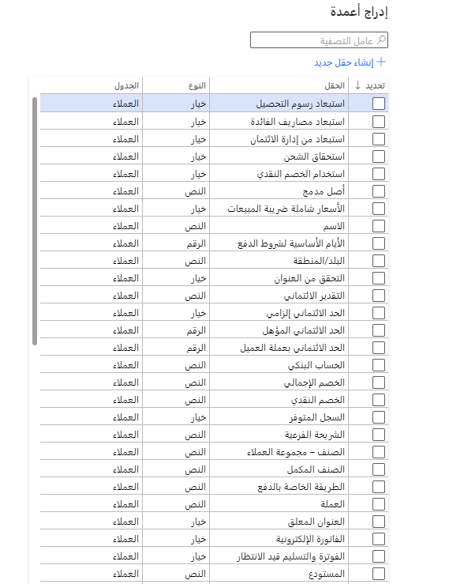

#### إضافة حقول

تسهّل تطبيقات التمويل والعمليات إضافة الحقول إلى نموذج من مصدر البيانات الأساسي للنموذج.

لمعرفة مدى سهولة ذلك، انتقل إلى "الوحدات النمطية"، "حسابات المقبوضات"، العملاء، جميع العملاء.
ستكون في صفحة قائمة "جميع العملاء". انقر بزر الماوس الأيمن فوق "رأس الشبكة" وحدد خيار "إضافة أعمدة".

> [!div class="mx-imgBorder"]
> 

سترى قائمة بجميع الأعمدة التي يمكن إضافتها، حسب الاسم ونوع البيانات وجدول المصدر. حدد المربع، وانقر فوق "إدراج"، وسيكون الحقل موجودًا!

> [!div class="mx-imgBorder"]
> 

#### تغيير المجالات

لتغيير حقل في نموذج، انقر بزر الماوس الأيمن في الحقل أو تسميته، وحدد "تخصيص". يمكنك القيام بأي مما يلي: تغيير اسم الحقل، أو إخفائه، أو تخطيه أثناء التنقل في النموذج، أو وضع علامة على أنه لا يمكن تحريره.

#### إزالة الحقول

لإخفاء حقل في نموذج، انقر بزر الماوس الأيمن في الحقل أو تسميته، وحدد "تخصيص". يمكنك بعد ذلك إخفائها.
