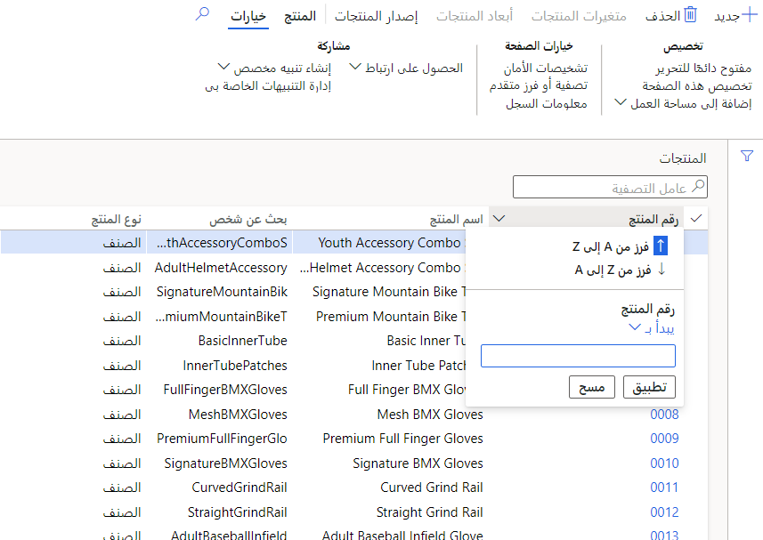

#### عوامل التصفية والنطاقات الأساسية

من السهل تحديد البيانات التي تظهر في نموذج معين. يتم إجراء التصفية بشكل شائع في صفحات القوائم، التي تستخدم الشبكات، ولكن يمكن استخدامها في أي مكان.

حدد القائمة المنسدلة على يمين الحقل ولاحظ خياراتك للفرز والتصفية.

> [!div class="mx-imgBorder"]
> 

خيارات معايير التصفية هي: بالضبط، وليس، ويحتوي على، ولا يحتوي على، ويبدأ بـ، وواحد من، وبعد، وقبل، والمطابقات.

> [!div class="mx-imgBorder"]
> 

لا يمكنك إجراء العديد من مستويات الفرز في الفرز الأساسي، عن طريق فرز حقول متعددة. يمكنك استخدام نطاقات متعددة.

#### التصفية المتقدمة

لاستخدام التصفية المتقدمة، حدد "الخيارات"، ثم "التصفية المتقدمة" أو "فرز".

> [!div class="mx-imgBorder"]
> 

ستسمح لك الشاشة الناتجة بتعديل الاستعلام المستخدم في النموذج من خلال:

-   تحديد نطاق للحقول

-   تحديد الفرز 
    > [!NOTE]
    > هنا يمكنك تحديد عمليات فرز متعددة المستويات

-   إضافة مصادر بيانات من خلال الصلات

> [!div class="mx-imgBorder"]
> 

يمكنك أيضا حفظ الاستعلام لاستخدامه في المستقبل، وسيكون متوفرًا حتى يتم مسح بيانات المستخدم.

> [!div class="mx-imgBorder"]
> 
