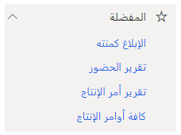

بالنسبة لهذا المعمل، ستكون شخصيتك هي مدير الإنتاج. تريد إنشاء اختصارات للعديد من أصناف القائمة التي تتنقل إليها بشكل متكرر.

1.  افتح Dynamics 365.

2.  انتقل إلى وحدة **‏‫التحكم في الإنتاج‬**.

3.  افتح عقدة أوامر الإنتاج وقم بالتمرير فوق كل أوامر الإنتاج، ثم انقر فوق النجمة التي تظهر.

4.  افتح عقدة التعديلات‬ وقم بالتمرير فوق ‏‫الإبلاغ كمنتهٍ‬، وضَع علامة على تلك العقدة كمفضلة.

5.  افتح عقدة الإنتاج ضمن الاستعلامات والتقارير، وضَع ‬‏‫إبلاغ أمر إنتاج في المفضلة.

6.  في وحدة الوقت والحضور، ضع تقرير الحضور في المفضلة ضمن  
    الحضور في القائمة الفرعية "الاستعلامات والتقارير".

7.  تحقق من أن قائمة المفضلة لديك تبدو كما يلي:

 > [!div class="mx-imgBorder"]
 > 
