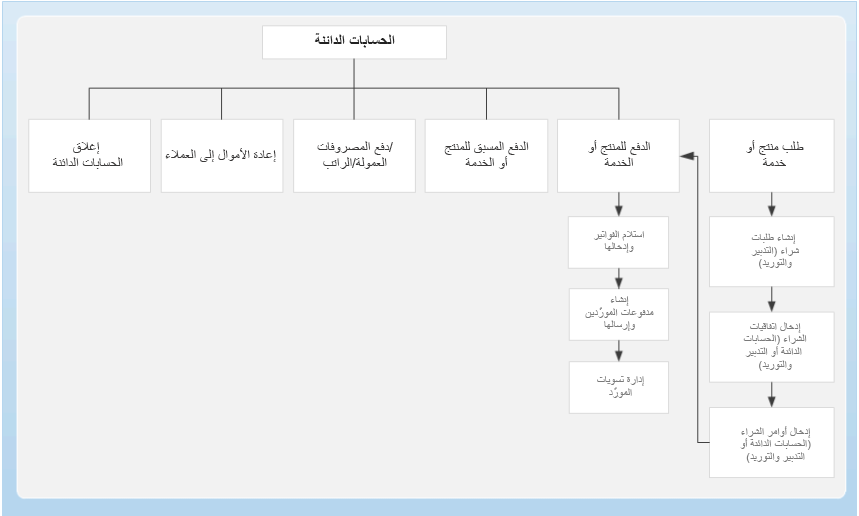

لمناقشة مدفوعات المورد، دعنا أولاً نفحص المكان الذي تتلاءم فيه مع عمليات الأعمال الخاصة بحسابات المدفوعات.

عند الدفع مقابل منتج أو خدمة يتم طلبها من المورد، ستحتاج إلى استلام الفواتير وإدخالها وإنشاء مدفوعات المورد وإرسالها وإدارة تسويات المورد.

توجد طرق متعددة لإدخال مدفوعات المورد، بما في ذلك استخدام عرض الدفع، وإدخال دفعة لمرة واحدة يدوياً والدفعات المسبقة. ستديرها من **حسابات المدفوعات > المدفوعات>دفتر يومية الدفع**.

### قم بإنشاء مدفوعات المورد باستخدام اقتراح الدفع

غالباً ما تُستخدم مقترحات الدفع لإنشاء مدفوعات المورد، لأنه يمكن استخدام الاستعلام لتحديد فواتير المورد بسرعة للدفع بناءً على معايير مثل تاريخ الاستحقاق والخصم النقدي.

غالباً ما تستخدم المؤسسات مقترحات الدفع لإنشاء مدفوعات المورد، لأنه يمكن استخدام استعلام مقترح الدفع لتحديد فواتير المورد بسرعة للدفع استناداً إلى تاريخ الاستحقاق والخصم النقدي ومعايير أخرى.

دعنا نراجع مثالاً. تعمل شركة Fabrikam مع الموردين الذين أصدروا الفواتير في الجدول التالي:

| **المورد**| **الفاتورة**| **تاريخ الفاتورة**| **مبلغ الفاتورة**| **تاريخ الاستحقاق**| **تاريخ الخصم النقدي**| **مبلغ الخصم النقدي**|
| :--- | :--- | :--- | :--- | :--- | :--- | :--- |
| 3050| 1001| 15 ‏‏يونيو| 500.00| 15 يوليو| 29 ‏‏يونيو| 10.00|
| 3050| 1002| 20 ‏‏يونيو| 600.00| 20 يوليو| 4 يوليو| 12.00|
| 3075| 1003| 15 ‏‏يونيو| 250.00| 29 ‏‏يونيو|| 0.00|
| 3100| 1004| 17 ‏‏يونيو| 100.00| 17 يوليو| 1 يوليو| 1.00|

في 1 يوليو، أبريل، الذي يتولى المدفوعات في Fabrikam، يدفع للموردين. إنها تستخدم اقتراح الدفع لمساعدتها على إكمال هذه المهمة بشكل أكثر كفاءة.

#### الخيار 1: عن طريق الخصم النقدي

يختار أبريل **الخصم النقدي** كنوع العرض. لقد أدخلت نطاقاً زمنياً من 26 يونيو إلى 10 يوليو. يتم تضمين الفواتير التالية في العرض:

- 1002، لأن تاريخ الخصم 4 يوليو يقع في نطاق تواريخ الدفع.

- 1004، لأن تاريخ الخصم 1 يوليو يقع في نطاق تواريخ الدفع.

لم يتم تضمين الفواتير التالية في العرض:

- 1001، لأن تاريخ الخصم 29 يونيو قد انتهى بالفعل، لذلك لم تعد هذه الفاتورة مؤهلة للخصم النقدي.

- 1003، لأن هذه الفاتورة ليس لها تاريخ خصم.

#### الخيار 2: حسب تاريخ الاستحقاق

يختار أبريل **لكل تاريخ استحقاق** كنوع الاقتراح. لقد أدخلت نطاقاً زمنياً من 26 يونيو إلى 10 يوليو. الفاتورة التالية مضمنة في العرض:

- 1003، لأن تاريخ الاستحقاق 29 يونيو يقع في نطاق تواريخ الدفع.

لم يتم تضمين الفواتير التالية في العرض:

- 1001، لأن تاريخ الاستحقاق 15 يوليو يقع خارج نطاق تواريخ الدفع.

- 1002، لأن تاريخ الاستحقاق 20 يوليو يقع خارج نطاق تواريخ الدفع.

- 1004، لأن تاريخ الاستحقاق 17 يوليو يقع خارج نطاق تواريخ الدفع.

#### الخيار 3: حسب تاريخ الاستحقاق والخصم النقدي

يختار أبريل **تاريخ الاستحقاق والخصم النقدي** كنوع العرض. لقد أدخلت نطاقاً زمنياً من 26 يونيو إلى 10 يوليو. يتم تضمين الفواتير التالية في العرض:

- 1003، لأن تاريخ الاستحقاق 29 يونيو يقع في نطاق تواريخ الدفع.

- 1002، لأن تاريخ الخصم 4 يوليو يقع في نطاق تواريخ الدفع.

- 1004، لأن تاريخ الخصم 1 يوليو يقع في نطاق تواريخ الدفع.

الفاتورة التالية غير مضمنة في العرض:

- 1001، لأن تاريخ الخصم 29 يونيو قد انتهى بالفعل، لذلك لم تعد هذه الفاتورة مؤهلة للخصم النقدي، كما أن تاريخ الاستحقاق 15 يوليو خارج نطاق التاريخ.

> [!NOTE]
> لمعرفة المزيد حول إنشاء مدفوعات المورد باستخدام اقتراح الدفع، قم بالوصول إلى الارتباطات المقابلة في وحدة الملخص في نهاية هذه الوحدة.

### المدفوعات المسبقة

قد تصدر المؤسسات مدفوعات مسبقة (مدفوعات مسبقة) للموردين للسلع أو الخدمات قبل الوفاء بهذه السلع أو الخدمات.

يمكن استخدام طريقتين لإصدار مدفوعات مسبقة للموردين: فواتير الدفع المسبق وقسائم دفتر اليومية للدفع المسبق. لتقليل المخاطرة، يمكنك تعقب الدفعات المقدمة بتحديد الدفعة المقدمة في أمر الشراء. بالنسبة لهذه الطريقة، يجب عليك إنشاء فاتورة الدفع المسبق المرتبطة بأمر الشراء. يشار إلى هذه الطريقة باسم فواتير الدفع المسبق. يمكن للمؤسسات التي لا ترغب في تعقب المدفوعات المسبقة بشكل وثيق أو لا تتلقى فاتورة الدفع المسبق من المورد استخدام قسائم دفتر اليومية للدفع المسبق بدلاً من طريقة إعداد الفواتير بالدفع المسبق. يمكنك إنشاء إيصالات يومية الدفعات المقدمة بإنشاء إدخالات دفتر اليومية ووضع علامة عليها كإيصالات يومية للدفعات المقدمة. بالنسبة لهذه الطريقة، لا يمكنك تعقب الدفعات المقدمة التي تم إصدارها إلى المورد مقابل أوامر الشراء. ومع ذلك، يمكنك وضع علامة على دفعة مسبقة تم ترحيلها للتسوية مقابل أمر الشراء.

> [!NOTE]
> لمعرفة المزيد حول الدفعات المسبقة، قم بالوصول إلى الارتباط المقابل في وحدة الملخص في نهاية الوحدة النمطية.

## التسويات

التسوية هي عملية تطبيق الدفع على فاتورة.

الآن دعنا نتفحص مثالاً للتسوية.

### تسوية دفعة جزئية لمورد والدفعة النهائية بالكامل قبل تاريخ الخصم

في هذا السيناريو، يتم إجراء مدفوعات جزئية لفاتورة المورد، ويتم أخذ خصم نقدي.

تشتري شركة Fabrikam البضائع من المورد 3064. يمنح المورد شركة Fabrikam خصماً نقدياً بنسبة 1 في المائة إذا تم دفع الفاتورة خلال 14 يوماً. يجب دفع الفواتير في غضون 30 يوماً. يتيح المورد أيضاً لشركة Fabrikam الحصول على خصومات نقدية على المدفوعات الجزئية. توجد معلمات التسوية في صفحة **> معلمات حسابات المدفوعات**.

#### فاتورة المورد في 25 يونيو

في 25 يونيو، أدخل أبريل فاتورة بمبلغ 1,000.00 للمورد 3064. يمكن لشهر أبريل عرض هذه المعاملة في صفحة **حركات المورد**.

من صفحة **الموردين**، يفتح أبريل **صفحة تسوية الحركات**. يمكنها استخدام صفحة تسوية الحركات لعرض تواريخ ومبالغ الخصومات النقدية. تاريخ الاستحقاق هو 25 يوليو، ويتوفر خصم نقدي قدره -10.00 إذا تم دفع الفاتورة بحلول 9 يوليو.

#### دفع جزئي في 1 يوليو باستخدام صفحة تسوية الحركات

يمكن لشهر أبريل إنشاء دفتر يومية للدفع لهذه الدفعة عن طريق فتح صفحة **دفتر يومية الدفع** في حسابات المدفوعات. تقوم بإنشاء دفتر يومية جديد وإدخال سطر للبائع 3064. ثم تفتح صفحة **تسوية الحركات**، حتى تتمكن من وضع علامة على الفاتورة للتسوية. يحدد شهر أبريل الفاتورة ويغير القيمة في الحقل المبلغ المراد تسويته إلى -500.00. ترى أن القيمة في الحقل **مبلغ الخصم النقدي** هي -10.00 للفاتورة الكاملة وأن القيمة في حقل **مبلغ الخصم النقدي يجب أن يتم** -5.05. لذلك، يقوم شهر أبريل بتسوية -505.05 من هذه الفاتورة.

يريد أبريل تسوية نصف الفاتورة بالضبط. لذلك، قامت بتغيير القيمة في الحقل **المبلغ المراد تسويته** -495.00. إجمالي المبلغ الذي تمت تسويته هو الآن 500.00. يتضمن هذا المبلغ الخصم النقدي -5.00.

يغلق أبريل صفحة **تسوية الحركات**. يتم إنشاء سطر دفع مقابل 495.00 في المجلة، ثم يقوم أبريل بنشر المجلة. يمكن لشهر أبريل مراجعة معاملات المورد في صفحة **حركات المورد**. لاحظت أن الفاتورة بها رصيد قدره -500.00. كما لاحظت دفع مبلغ 495.00 وخصم نقدي قدره 5.00.

#### تم دفع المبلغ المتبقي في 8 يوليو

يدفع أبريل باقي الفاتورة للبائع 3064 في 8 يوليو، وهي فترة الخصم النقدي. يُنشئ أبريل دفتر يومية الدفع في 8 يوليو ويضع علامة على حركة التسوية. لاحظت أن المبلغ الذي يجب تسويته هو 495.00. القيمة الموجودة في الحقل **الخصم النقدي المقدر** هي -5.00، لأنه تم الحصول على الخصم 5.00 مسبقاً.

ينشر أبريل دفتر يومية الدفع ويراجع حركات المورد في صفحة **حركات المورد**. رصيد الفاتورة الآن 0.00.

