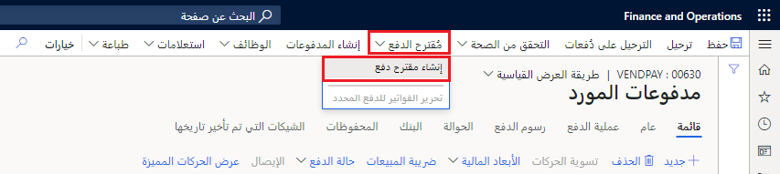
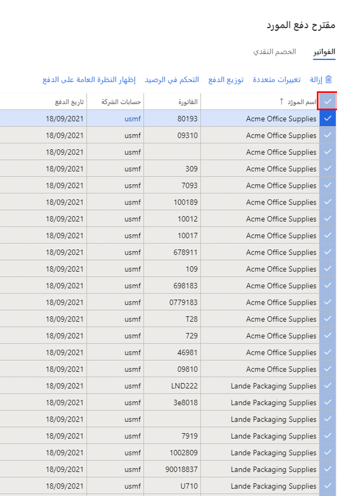
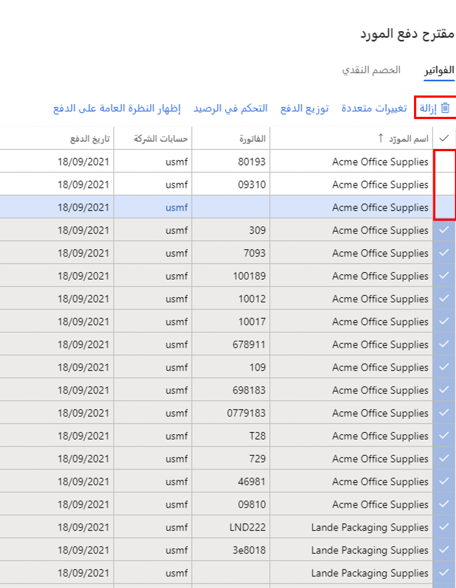

[!INCLUDE]
[!INCLUDE]

## خطوات المعمل

1. في صفحة Finance and Operations الرئيسية، أعلى اليسار، تحقق من أنك تعمل مع شركة USMF.

2. إذا لزم الأمر، حدد الشركة ومن القائمة، حدد **USMF**.

3. في جزء التنقل الأيمن، حدد **الوحدات النمطية** > **حسابات مدفوعات** > **المدفوعات** > **دفتر يوميات دفع المورد**.

4. في القائمة العلوية، حدد **+ جديد**.

5. لاحظ رقم دفعة دفتر اليومية الجديد الذي تم إنشاؤه.

6. في المربع **الاسم**، أدخل **Vend**، ثم حدد **VendPay** من القائمة التي تمت تصفيتها.

7. في القائمة العلوية، حدد **خطوط**.

8. في صفحة مدفوعات المورد، في القائمة العلوية، حدد اقتراح الدفع> إنشاء اقتراح الدفع.

9. اقتراح الدفع هو استعلام يستخدم لتحديد فواتير للدفع. يمكنك تحرير قائمة الفواتير للدفع قبل إنشاء أو إنشاء مدفوعات المورد.

    > [!div class="mx-imgBorder"]
    > 

10. في جزء اقتراح دفع المورد، ضمن **معايير تحديد الفاتورة**، حدد **تحديد الفاتورة بواسطة**، وراجع الخيارات المتاحة، ثم حدد **تاريخ الاستحقاق**.

11. في **من التاريخ** و **إلى تاريخ**، احذف أي قيمة موجودة. بالنسبة لهذا التمرين، سيتم ترك نطاقات التواريخ هذه فارغة.

    > [!NOTE]
    > يمكن استخدام تاريخ الحد الأدنى للدفع كتاريخ الدفع. سيكون الحد الأدنى لتاريخ الدفع هو أقرب تاريخ يتم استخدامه عند إنشاء المدفوعات. على سبيل المثال، إذا كان للفاتورة تاريخ استحقاق بعد الحد الأدنى لتاريخ الدفع، فسيصبح تاريخ الاستحقاق هو تاريخ الدفع بدلاً من الحد الأدنى لتاريخ الدفع لدفع الفاتورة في آخر تاريخ ممكن.

12. وسّع **السجلات لتضمين**، وراجع الخيارات.

13. غالباً ما يتم استخدام عامل التصفية لتقييد الفواتير المحددة للدفع بواسطة مجموعة الموردين أو طريقة الدفع. على سبيل المثال، يمكنك إضافة عامل تصفية لدفع الفواتير فقط عن طريق الشيك في تشغيل الدفع هذا.

14. قم بتوسيع **المعلمات المتقدمة**، وراجع الخيارات المتاحة.

15. يمكن استخدام المعلمات الإضافية لتحديد عملة الدفع أو لتمكين المدفوعات المركزية لتشغيل الدفع هذا.

16. حدد **موافق**.

17. بعد تحديد موافق، ستظهر نتائج الاستعلام. Iإذا كنت لا تريد معاينة قائمة الفواتير المحددة للدفع، فيمكنك العودة إلى علامة التبويب "المعلمات السريعة" وتغيير الإعداد **إنشاء مدفوعات بدون معاينة الفاتورة** إلى **نعم**.

18. في نافذة اقتراح دفع المورد، حدد **عرض نظرة عامة على الدفع** لعرض المدفوعات التي سيتم إنشاؤها للمورد في الفاتورة المحددة.

    > [!div class="mx-imgBorder"]
    > 

19. في القائمة، حدد **إخفاء نظرة عامة على الدفع** لإخفاء المدفوعات.

20. حدد رمز علامة الاختيار على يسار عنوان العمود **اسم المورد** لتحديد جميع الفواتير.

    > [!div class="mx-imgBorder"]
    > 

21. امسح خانة الاختيار للفواتير الثلاث الأولى، ثم في القائمة، حدد **إزالة** لإزالة جميع الفواتير الأخرى.

    > [!div class="mx-imgBorder"]
    > 

22. في مربع الحوار، حدد **نعم**.

23. راجع الفواتير الثلاث المتبقية.

24. لتصدير قائمة الفواتير إلى Excel، انقر بزر الماوس الأيمن فوق الشبكة وحدد خيار تصدير.

25. في الزاوية اليمنى السفلية، حدد **إنشاء مدفوعات** لإنشاء مدفوعات المورد في دفتر يومية الدفع.

26. راجع قائمة مدفوعات الموردين.

[!INCLUDE]