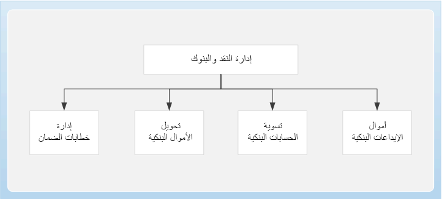

يمكنك استخدام إدارة النقد والبنوك للاحتفاظ بالحسابات المصرفية للكيان القانوني والأدوات المالية المرتبطة بهذه الحسابات المصرفية.

وتشمل هذه المستندات إيصالات الإيداع والشيكات والكمبيالات والسندات الإذنية. كما يُمكنك تسوية كشوف الحسابات البنكية‬ وطباعة البيانات البنكية في التقارير القياسية.

ترتبط وحدة إدارة النقد والبنوك ارتباطاً وثيقاً بوحدات الحسابات الدائنة والحسابات المقبوضات. 

## عمليات الأعمال

هناك أربع عمليات تجارية تحت إدارة النقد والبنوك:

- إيداع أموال البنك.

- تسوية الحسابات البنكية.

- تحويل الأرصدة البنكية.

- إدارة خطابات الضمان.

## إيداع أموال البنك

باستخدام وحدة **إدارة النقد والبنوك** في الماليات، يمكنك الاحتفاظ بالحسابات المصرفية لكيانك القانوني والأدوات المالية المرتبطة بهذه الحسابات. قد يشمل ذلك قسائم الإيداع أو الكمبيالات أو السندات الإذنية أو الشيكات.

إيصال الإيداع هو مستند يُستخدم لإيداع الشيكات وإشعارات بطاقات الائتمان والنقد في حساب بنكي. استخدم صفحة **إيصال الإيداع** لعرض وإدارة إيصالات الإيداع للمدفوعات في الحسابات البنكية.

يمكنك إلغاء دفع إيصال الإيداع إذا كانت عملية دفع العميل غير صالحة. إذا كنت قد قمت بالفعل بتسوية إيصال الإيداع في كشف الحساب البنكي، فلا يمكنك إلغاء عملية الدفع.

## تسوية حساب البنك

عندما تتلقى كشف حساب بنكي، يجب عليك إجراء تسوية دورية للمعاملات المصرفية للكيان القانوني مع المعاملات الموجودة في كشف الحساب المصرفي.

لا يمكنك تسوية كشف حساب بنكي مع حساب مصرفي إذا كان أي من الشيكات أو مدفوعات قسيمة الإيداع المدرجة في البيان لديها حالياً حالة **الإلغاء المعلق**. بعد قيام المراجع بنشر أو رفض إلغاء الشيك أو إلغاء دفع قسيمة الإيداع، لم تعد الحالة **الإلغاء المعلق**، ويمكنك تسوية الحساب المصرفي.

- لمعرفة المزيد حول تسوية كشوف الحسابات البنكية، قم بالوصول إلى الارتباط المقابل في وحدة **الملخص** في نهاية هذه الوحدة.

## إدارة خطابات الضمان

**خطاب الضمان** هو اتفاق من قبل البنك (الضامن) لدفع مبلغ محدد من المال إلى شخص ما (المستفيد) إذا تخلف عميل البنك (الأصل) عن السداد أو التزام تجاه المستفيد. خطابات الضمان غير القابلة للتحويل. تنطبق فقط على المستفيد المذكور اسمه في الاتفاقية. يمكن للمدير أن يطلب زيادة أو نقصان في قيمة خطاب الضمان، وفقاً لشروط الاتفاقية.

يمكنك استخدام صفحة **خطاب الضمان** لإكمال هذه المهام:

- إنشاء إدخالات دفتر الأستاذ الصحيحة والتخلص من الإدخال اليدوي.

- تسجيل جميع المعاملات النقدية وغير النقدية، وتعقب أرصدة خطابات الضمان.

- تسجيل وتتبع حالة وانتهاء صلاحية خطابات الضمان.

- إنشاء تقرير يسرد البنوك التي لديها خطابات الضمان.

## التسويات

أثناء التسوية، يتم تطبيق المعاملات الموجودة في مستند واحد على الحركات الموجودة في مستند آخر لزيادة أو تقليل رصيد كل مستند. على سبيل المثال، يمكن تطبيق دفعة على فاتورة. يمكن تسوية أنواع مختلفة من المعاملات في أوقات مختلفة من خلال طرق مختلفة. يمكن لعملية التسوية أيضاً إنشاء معاملات جديدة.

يمكن أن تحدث التسوية بين أي أنواع حركات تؤثر على رصيد البائع أو رصيد العميل. يمكن أن تتضمن أنواع الحركات هذه الفواتير والمدفوعات والمذكرات الدائنة والرسوم. يمكن تسوية أي نوع معاملة مقابل أي نوع حركة آخر. 

أنواع الحركات التالية متاحة للاستخدام في تسويات شركة واحدة وعبر شركات:

- التسوية

- الخصم النقدي

- إعادة تقييم العملات الأجنبية (بما في ذلك إعادة تقييم العملات الأجنبية المحققة وغير المحققة)

- فروق نقدية

- زيادة في الدفع/نقص في الدفع

> [!NOTE]
> لمعرفة المزيد حول تسوية المدفوعات المركزية، قم بالوصول إلى الارتباط المقابل في وحدة الملخص في نهاية هذه الوحدة.

