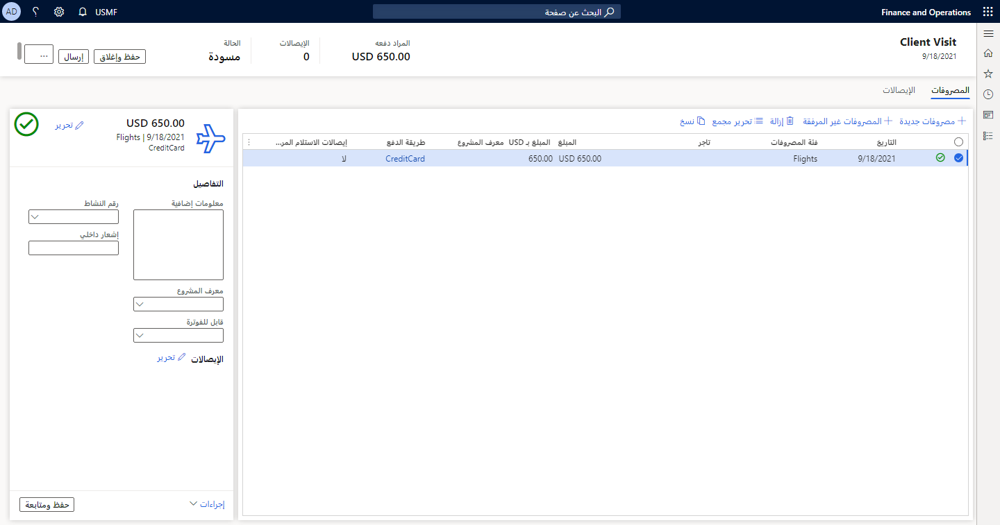
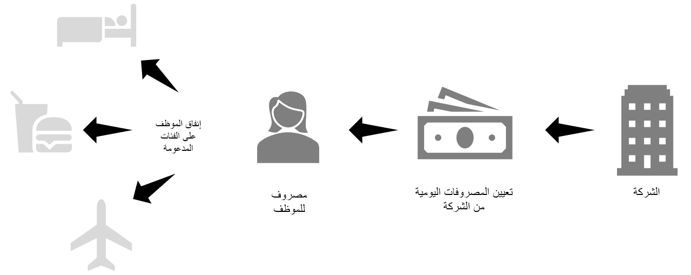
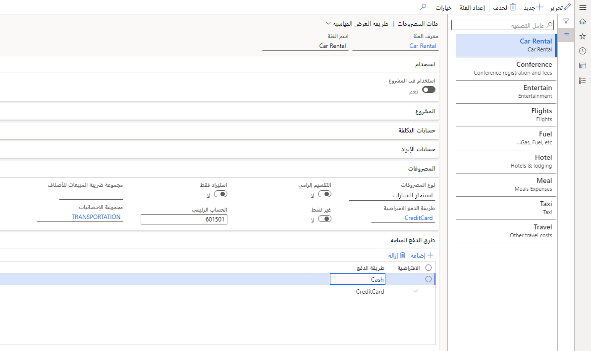

في هذه الوحدة، ستتعرف على الوظائف الأساسية لإدارة المصروفات، وميزاتها المبسطة، والاعتبارات الخاصة بتخطيط التنفيذ الخاص بك لتعزيز قدرات إدارة النفقات في مؤسستك.

تم تبسيط قدرات إدارة النفقات لعمليات إدارة النفقات في مؤسستك. يمكنك استخدام إدارة المصروفات لإنشاء مهام سير عمل تلقائية لجمع معلومات حول طرق الدفع التي يمكن استخدامها ولتتمكن من تعقب عدد مرات استخدام بطاقة ائتمان الشركة مقابل النقد، على سبيل المثال. يمكنك أيضاً استيراد مشتريات بطاقة الائتمان ومراقبة الأموال التي ينفقها الموظفون على نفقات مؤسستك. ستكون قادراً على استخدام سياسات المصروفات والمعلمات الأخرى الجاهزة لإعداد وإدارة نفقات المؤسسة عبر الفئات والتنفيذ التلقائي لسداد نفقات السفر.

في مساحة عمل إدارة الميزات، يمكنك تمكين ميزة إعادة تصور تقارير المصاريف لتبسيط التجربة وتقليل الوقت اللازم لإكمال تقارير النفقات. لتخصيص رؤية حقول النموذج، يمكنك إضافة صفحة إعداد جديدة وتحديد البيانات المطلوبة أو الاختيارية أو غير الضرورية عند إدخال تقارير المصروفات. عند تمكين هذه الميزة، سيتم فتح مساحة عمل جديدة للمصروفات.

مساحة عمل إدارة المصروفات هي الصفحة المقصودة لإنشاء تقارير المصروفات وإرسالها.

> [!div class="mx-imgBorder"]
> 

تشمل الميزات الإضافية لتقارير النفقات ما يلي:

- مساحة لتعقب المصروفات التي تساعدك على عرض مصروفات مفوضك.

- تجربة المطابقة مع الإيصالات للمساعدة في عرض الإيصالات على مستوى الرأس وتحسين طريقة إضافة الإيصالات إلى بنود المصروفات.

- شبكة حديثة للقراءة فقط تتيح لك عرض المزيد من سطور النفقات وأعمدة البيانات الإضافية. ستظهر بنود مفصّلة ومتقطعة، إلى جانب المصروفات الأصلية.

- جزء مبسط لتحرير المصروفات.

تتيح لك ميزة إعادة تصور تقارير المصروفات الوصول إلى نفقات المندوبين من خلال مساحة عمل حديثة لإدارة النفقات. يتضمن جزءاً بسيطاً وبديهياً لتحرير النفقات وخطأ متقدماً ونظام تحذير ورسائل السياسة لضمان وقت تعطل أقل بسبب التصحيح أو انتظار عمليات التحرير لإرسال تقرير المصروفات بنجاح. في حالة ظهور مشكلات، يمكن لسير عمل المصاريف توجيه المستخدمين إلى الخطأ وتقديم اقتراحات حول ما يجب إصلاحه.

توفر إدارة المصروفات أيضاً تذكيرات لطيفة بالسياسة للمستخدمين لمساعدة المؤسسة على البقاء في حالة امتثال. لضمان حصولك على التجربة الكاملة، تأكد من استخدام مساحة عمل إدارة الميزات لتمكين ميزة مطابقة إيصال تقارير النفقات.

## تخطيط إدارة المصروفات

يجب على المؤسسة اتخاذ القرارات والتصرف عند إعداد إدارة المصروفات خلال فترة التخطيط قبل التوزيع.

يمكنك تخزين التفاصيل المتعلقة بطرق الدفع وطلبات السفر المطلوبة وتقارير المصاريف والقواعد وما إلى ذلك في إدارة النفقات. تستند جميع الاختيارات التي تقوم بها أثناء تكوين إدارة التكلفة إلى التدرج الهرمي للمؤسسة والخلفية المالية. لذلك، يجب عليك الرجوع إلى الوثائق المناسبة لتلك المجالات المثيرة للقلق، مثل القواعد الضريبية المحددة لمؤسستك أو موقع المؤسسة، والتي يمكن أن يكون لها قواعد ولوائح محددة يجب حسابها خلال فترة التخطيط.

## المصروفات اليومية

يجب تحديد الموظف اليومي الذي توفره شركتك. نظراً لاستخدام المصروفات اليومية عادةً لتغطية المصروفات مثل الوجبات والإقامة والمصروفات العرضية الأخرى، يمكنك إنشاء إرشادات لبدلات المصروفات اليومية التي تقدمها شركتك. قد يعتمد المصروف اليومي على الوقت من السنة أو وجهة السفر أو كليهما.

عند تقييم شرط البدل اليومي، يمكنك تحديد جزء من معدل البدل اليومي إذا تلقى العامل وجبات أو خدمات مجانية. يمكنك أيضاً تحديد عتبات معدل المصروفات اليومية وتعيين الحدين الأدنى والأقصى لعدد الساعات التي تتم إضافتها إلى سفر العامل حسب معدل المصروفات اليومية.

### تنفيذ المصروفات اليومية

يجب عليك اتخاذ عدة قرارات بخصوص تنفيذ المصروفات اليومية. اسأل نفسك الأسئلة التالية.

قواعد المصروفات اليومية الافتراضية لليومين الأول والأخير:

- ما هو الحد الأدنى لعدد الساعات التي يمكن لأحد الموظفين المطالبة بها ليوم ما واستمرار استلام المصروف اليومي؟

- هل هناك تخفيض في المبلغ المقدم لوجبات الطعام لليومين الأول والأخير؟ في حالة وجود تخفيض، ما النسبة المئوية للتخفيض؟

- هل هناك تخفيض في المبلغ المقدم للفندق لليومين الأول والأخير؟ إذا كان كذلك، ما النسبة المئوية للتخفيض؟

- هل هناك تخفيض في المبلغ المقدم للمصروفات الأخرى التي يتم تحملها لليومين الأول والأخير؟ إذا كان كذلك، ما النسبة المئوية للتخفيض؟

قواعد المصروفات اليومية الافتراضية:

- هل هناك نسبة تخفيض في بدل المصروفات اليومية لكل وجبة إذا كانت الوجبة مجانية على سبيل المثال؟ في حالة وجود تخفيض، ما النسبة المئوية للتخفيض لكل وجبة؟

- هل يتم احتساب تخفيض الوجبة عن كل يوم أم لكل رحلة أم بعدد الوجبات اليومية؟

- هل يتعين تقريب مبالغ المصروفات اليومية بالطريقة العادي أم تقريبها لأعلى؟

- هل يتم احتساب المصروفات اليومية استناداً إلى فترة 24 ساعة أو يوم تقويم؟

> [!div class="mx-imgBorder"]
> ![لقطة شاشة تصور صفحة معلمات إدارة النفقات. يمكنك ضبط الإعدادات الافتراضية لإطارات المعدل اليومي. يمكنك إعداد الإعدادات الافتراضية لليوم الأول واليوم الأخير: الحد الأدنى لساعات البدل اليومي، ونسبة الوجبة، ونسبة الفندق، وغيرها. تتيح لك الصفحة أيضاً إعداد تخفيضات الوجبات في وجبات الإفطار والغداء والعشاء واختيار كيفية احتساب تخفيض الوجبات. في هذا المثال، يتم حساب تقليل الوجبة حسب نوع الوجبة لكل رحلة. يمكنك أيضاً اختيار نوع التقريب اليومي، على سبيل المثال التقريب العادي، وما الذي يجب أن يستند إليه الحساب اليومي، على سبيل المثال يوم تقويمي مع الوقت.](../media/5-3-per-diem-page.png)

قواعد المصروفات اليومية التي تستند إلى الموقع:

- هل تختلف معدلات المصروفات اليومية وفقاً للموقع؟ ما المواقع المضمنة؟

- إذا اختلفت معدلات المصروفات اليومية وفقاً للموقع، لكل موقع، ما النسبة المئوية للمبلغ الذي يتم توفيره لأنواع المصروفات التالية؟

  - الوجبات

  - الفندق

  - مصروفات أخرى

## طرق الدفع

يجب عليك تحديد طرق الدفع التي يتعين على الموظفين استخدامها عندما تسمح لهم بتكبد نفقات نيابة عن شركتك. علي سبيل المثال، قد تسمح للعاملين باستخدام النقود أو بطاقة ائتمان خاصة بشركة. يمكنك أيضاً السماح للموظفين باستخدام بطاقات الائتمان الشخصية ثم تعويضهم.

## السياسات

تساعد السياسات على ضمان عدم تجاوز الموظفين حدود الموازنة، وتوفير جميع المعلومات المطلوبة، وإنفاق الأموال عند الحاجة فقط.

تُدرج قواعد السياسة في فئات المصاريف التي طورتها المؤسسة خلال فترة تخطيط النفقات.

> [!div class="mx-imgBorder"]
> 

يتعين مراعاة العوامل التالية لكل سياسة تقرير مصروفات والاعتماد الذي تم إنشاؤه:

- اسم السياسة

- الغرض من سياسة المصروفات

- إذا تم تمكين المصروفات بين الشركات الشقيقة، فما هي الشركات التي سيتم تطبيق هذه السياسة عليها

- ما إذا كان للسياسة إطار زمني فعال

- إذا كان للسياسة تاريخ انتهاء

- المعلمات الدقيقة لقاعدة السياسة

- النتيجة المرجوة من قاعدة السياسة

## فئات المصروفات والفئات المشتركة

عندما يقوم الموظفون بإنشاء تقرير مصروفات، يجب ربط كل مصاريف يقومون بتسجيلها بفئة مصروفات.

يتم اشتقاق فئات المصروفات من الفئات التي يمكن مشاركتها عبر الكيانات القانونية في مؤسستك. يمكن أيضاً مشاركة هذه الفئات في إدارة المشروع والمحاسبة، اعتماداً على كيفية تعريف مؤسستك.

ملاحظة: يمكن مشاركة فئات المصروفات بين المشروع والمصروفات أو المشروع والإنتاج، ولكن ليس بين المصروفات والإنتاج.

تتضمن بعض فئات المصروفات المستخدمة على نطاق واسع تذاكر الطيران والإقامة والوجبات والانتقالات.

> [!div class="mx-imgBorder"]
> 

أسئلة يتعين مراعاتها عند إنشاء فئات المصروفات لمؤسسة:

- ما هو نوع المصروفات؟ فئات الرحلات الجوية أو الفنادق أو الأميال على سبيل المثال.

- هل يمكن استخدام فئة المصروفات في إدارة المشاريع والمحاسبة؟

- ما هي طريقة الدفع الافتراضية التي يجب تحديدها لفئة المصاريف؟

- ما هو الحساب الافتراضي لفئة المصروفات؟

