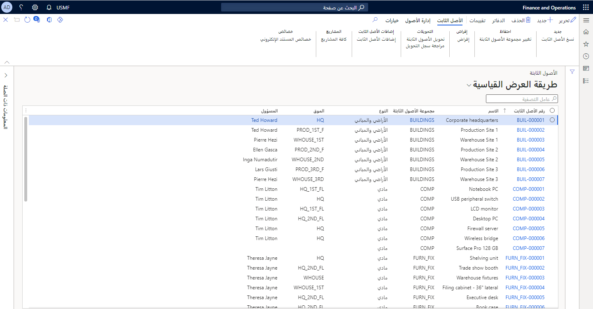

## الأصول الثابتة والحالية

في الموازنة العمومية للشركة، يتم تقسيم الأصول إلى مجموعتين:

- الأصول الثابتة

- الأصول الحالية

من المهم تحديد الاختلافات بين الأصول الثابتة والحالية قبل مناقشة كيفية حساب كل منهما. لا يعتمد تصنيف الأصول على الطبيعة المادية للأصل، ولكن بالأحرى على الغرض من ملكية الأصل.

الأصول الحالية هي تلك التي تستنفدها الشركة في سياق العمل المعتاد خلال العام المقبل أو دورة العمل، أيهما أقصر.

تشمل أمثلة الأصول المتداولة ما يلي:

- نقدي

- حسابات المقبوضات

- مصروفات مدفوعة مقدماً

- المخزون

الأصول الثابتة هي الأصول التي تمتلكها الشركة وتستخدمها في العمليات اليومية للشركة وليست مخصصة لإعادة بيعها للعملاء. تمتد الأعمار الإنتاجية لهذه الأصول لعدة سنوات.

تتضمن أمثلة الأصول الثابتة ما يلي:

- المركبات

- أجهزة الكمبيوتر

- الماكينات

- المباني

- حقوق الطبع والنشر أو العلامات التجارية (فئة خاصة من الأصول تسمى بشكل متكرر الأصول غير الملموسة)

بناءً على هذه التعريفات، يمكن تصنيف نفس الأصل كأصل ثابت في شركة واحدة وكأصل حالي أو صنف مخزون في شركة أخرى.

مثال على شركة يمكن فيها تصنيف نفس الأصل على أنه ثابت وحالي على حد سواء، وكالة بيع سيارات. المركبات المحتفظ بها للبيع هي أصناف مخزون بالإضافة إلى الأصول الحالية، في حين أن سيارة شركة الموظف هي أصل ثابت.

## محاسبة الأصول الثابتة

يتم التعامل مع جميع الأصول الثابتة على أنها معاملات الموازنة العمومية في السنة التي يتم الحصول عليها فيها ويتم ترحيلها كأصل إلى حساب الموازنة العمومية.

تمثل الأصول الثابتة قيمة دائمة وليست مجرد نفقات في سنة الشراء.

عادة ما يتم استهلاك الأصول الثابتة، أو إنفاقها، على مدار عمرها الإنتاجي. قد يكون من الضروري أيضاً إجراء تعديلات إضافية. التعديل الأكثر شيوعاً، المعروف باسم الإهلاك، هو الإدخال الذي ينفق جزء من سعر الشراء الأصلي للأصل الذي تم استخدامه خلال السنة.

يتم استخدام طرق مختلفة للإهلاك. يتم حساب إحدى الطرق، الخط المستقيم، عن طريق أخذ تكاليف الاستحواذ وقسمة تلك التكاليف على العمر التشغيلي المتوقع للأصل. عادة ما يتم تحديد القواعد التي تحدد حساب الاستهلاك في التشريعات المحلية.

> [!div class="mx-imgBorder"]
> 

بالنسبة لجميع الأصول، يجب مراجعة قيمة الأصل في الموازنة العمومية (صافي القيمة الدفترية) مرة واحدة على الأقل كل عام. بالنسبة لجميع الأصول، يجب مراجعة قيمة الأصل في الموازنة العمومية (صافي القيمة الدفترية) مرة واحدة على الأقل كل عام. إلى جانب مراجعة القيمة هذه، قد يكون من الضروري تعديل قيمة الأصول في الموازنة العمومية (الشطب أو الشطب).

عادة ما تكون مبالغ الشطب أو التسوية بالزيادة ناتجة عن بعض الأحداث غير العادي في السوق والتي تؤثر على السعر إذا كانت الشركة ستعيد شراء الأصل. على سبيل المثال، قد يكون سبب ارتفاع سعر المبنى هو سوق العقارات. تحظر مبادئ المحاسبة في بعض البلدان أو المناطق كتابة الأصول.

عندما لا يكون لدى الشركة استخدام للأصل، لأنه إما يتم بيعه أو إلغاؤه، يجب إزالة الأصل من دفاتر المحاسبة. لذلك، يتم عكس سعر الشراء الأصلي والاستهلاك المتراكم للأصل، ويتم ترحيل أي فائض أو خسارة ناتجة عن الاستبعاد إلى بيان الربح والخسارة.

## العلاقات بين مكونات الأصول الثابتة

يوضح الشكل التالي علاقات وحدة الأصول الثابتة في المال.

تتيح لك مجموعات الأصول الثابتة تجميع الأصول الخاصة بك وتحديد السمات الافتراضية لكل أصل معين لمجموعة.

يتم تخصيص الكتب لمجموعات الأصول الثابتة. تتعقب الدفاتر القيمة المالية للأصل الثابت بمرور الوقت باستخدام تكوين الإهلاك المحدد في ملف تعريف الإهلاك.

يجب عليك أولاً إعداد ملفات تعريف الإهلاك. في ملف تعريف الإهلاك، يمكنك تكوين كيفية إهلاك قيمة الأصل بمرور الوقت. تحتاج إلى تحديد طريقة الاستهلاك وسنة الإهلاك (السنة التقويمية أو السنة المالية) وتكرار الاستهلاك.

بعد إعداد الكتب، يمكنك إنشاء ملف تعريف الترحيل. يجب تعريف ملف تعريف الترحيل بواسطة الدفتر، ولكن يمكن أيضاً تعريفه على مستوى أكثر تفصيلاً. على سبيل المثال، يمكنك تعريف ملف تعريف الترحيل لمجموعة من دفتر ومجموعة أصول ثابتة أو حتى لدفتر أصول ثابتة فردي. بشكل افتراضي، يتم استخدام حسابات دفتر الأستاذ التي تم تحديدها لمعاملات الأصول الثابتة الخاصة بك.

