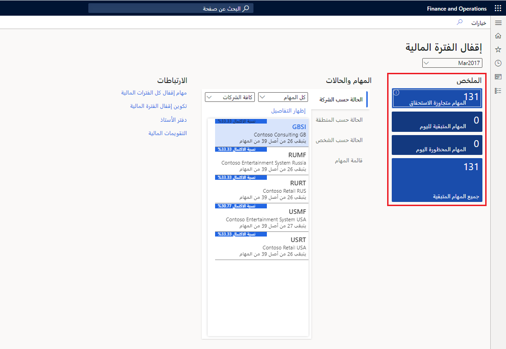

في Dynamics 365 Finance، يمكنك إكمال إجراءات الإغلاق لفترة ما، كيوم أو شهر أو سنة. يؤدي إغلاق العمليات إلى إعداد النظام لفترة جديدة.

## الإعداد لإغلاق الفترة المالية

تمتلك كل مؤسسة عمليات وخطوات مختلفة تنفذها في نهاية الفترة. تشمل الخطوات الاختيارية لنهاية الفترة ما يلي:

- تسوية الفواتير والمدفوعات.

- ترحيل جميع معاملات نهاية الفترة.

- التحقق من ترحيل جميع دفاتر اليومية.

- إجراء إعادة تقييم العملة الأجنبية لدفتر الأستاذ العام، لإنشاء أية مبالغ أرباح أو خسارة غير محققة.

- إجراء إعادة تقييم للعملة الأجنبية، وذلك للحسابات الدائنة، وحسابات المقبوضات.

- تسوية حركات دفتر الأستاذ.

- معالجة أي توزيعات مطلوبة.

- تسويه دفتر الأستاذ الفرعي بدفتر الأستاذ العام.

- ترحيل تسويات نهاية الفترة يدوياً.

- تسجيل دفتر يومية الحركات ومراجعة تقرير دفتر يومية دفتر الأستاذ.

- تنفيذ تجميع من خلال شركة تجميع أو من خلال إعداد التقارير المالية.

- إنشاء القوائم المالية لنهاية الفترة من خلال إعداد التقارير المالية.

- قم بتعيين فترات دفتر الأستاذ على قيد الانتظار بحيث لا يحدث أي ترحيل آخر. وللتحكم بشكل أفضل، يمكنك أيضاً تقييد فترة لمجموعة مستخدمين محددة أثناء حدوث أنشطة نهاية الفترة. وكخيار أمثل، نوصي بعدم استخدام الحالة **تمّ الإغلاق بشكل دائم** لأنه لا يمكنك أعاده فتح فترة تم تعيينها على **تمّ الإغلاق بشكل دائم**. ويُمكنك استخدام هذه الحالة في وقت لاحق.

### مساحة عمل إغلاق الفترة المالية

تسمح لك مساحة عمل **إغلاق الفترة المالية** بتعقب عمليات الإغلاق المالي عبر الشركات والمناطق والأشخاص. وبحسب طريقة عرض مساحة عمل **إغلاق الفترة المالية**، سيظهر لك ترى إما جميع المهام والحالات الخاصة بجدول إغلاق، أو المهام التي تم تعيينها لك فقط.

بإمكانك العثور على مساحة العمل **إغلاق الفترة المالية** بالوصول إلى **دفتر الأستاذ العام > مساحات العمل > إغلاق الفترة المالية**. يمكنك استخدام مساحة العمل لتنظيم المهام المطلوبة لعمليات إنهاء الفترات المتعددة وتعقبها.

يجب أولاً تحديد جدول إغلاق أعلى مساحة العمل. وتتم عندئذٍ تصفية جميع البيانات المعروضة في مساحة العمل حسب جدول الإغلاق المحدد.

توفّر لك إطارات **الملخص** المتجانبة نظرة عامة حول العملية، وتساعدك المؤشرات في إبقاء عملية الإغلاق على المسار الصحيح. يقومون بإظهار المهام المتجاوزة لتاريخ الاستحقاق، والمهام المتبقية لليوم الحالي، والمهام المستحقة اليوم ولكنها محظورة بسبب التبعيات، بالإضافة إلى جميع المهام المتبقية للعملية. وتختص هذه المعلومات بجميع الشركات التي تم تضمينها في جدول الإغلاق المحدد.

> [!div class="mx-imgBorder"]
> 

> [!NOTE]
> لمعرفة المزيد حول تكوين إغلاق الفترة المالية، انتقل إلى الارتباط المقابل في الوحدة "الملخص" في نهاية هذه الوحدة.

## تقرير نهاية العام رقم 1099

إذا كنت تتعامل مع الموردين الذين يخضعون لضريبة الولايات المتحدة 1099، فيجب تعقب المبلغ الذي تدفعه لكل مورد وإبلاغ هيئات الضرائب الأمريكية بهذه المعلومات في نهاية سنة التقويم. وعادة ما يكون الموردون أفرادًا ليسوا موظفين ويقدمون خدمات لمؤسستك. عليك أيضًا إرسال كشف حساب إلى كل مورد خاضع لضريبة 1099 تتعامل معه، لإخطاره بالمبلغ الذي تقوم بالإبلاغ عنه إلى هيئات الضرائب.

بالنسبة لكل مورّد أعددته ليكون مورد خاضع لضريبة 1099، يتم تعقب المبالغ ضمن "الأمور المالية" على مدار السنة. في بنود الفاتورة، يمكنك استخدام الحقلين مربع 1099 ومبلغ 1099 لتعقب مبالغ 1099. وحتى في حالة عدم إدخال قيمة في حقل مبلغ 1099، تساهم أي دفعة تم ترحيلها لمبلغ الفاتورة في إجمالي 1099 الخاص بالمربع 1099 المحدد. إذا قمت بإدخال مبلغ 1099، فسيتم استخدام المبلغ الذي أدخلته بدلاً من مبلغ الدفع المرحّل.

يمكن للمالية معالجة معلومات 1099-MISC و1099-DIV و1099-INT و1099-S (عائدات الحركات العقارية) و1099-G (بعض المدفوعات الحكومية). يمكنك دفع فاتورة بمعلومات 1099-G و1099-S ومعالجة الكشوف الضريبية 1099-G و1099-S.

> [!NOTE]
> لمعرفة المزيد حول تقرير "نهاية العام 1099"، راجع الارتباط المقابل في الوحدة "الملخص" في نهاية هذه الوحدة التدريبية.

## إغلاق نهاية الشهر

لننتقل إلى أحد العروض التوضيحية الذي يوضح لك طريقة معالجة إغلاق نهاية الشهر.

| | شاهد هذا الفيديو لمعرفة المزيد حول إغلاق نهاية الشهر.|
| :--- | :--- |

>[!VIDEO https://www.microsoft.com/videoplayer/embed/RE4MDdt]

## معالجة إغلاق نهاية العام

في نهاية العام، من الضروري دائمًا إتمام المهام التالية:

- إجراء قيود التسوية التي تُلغي حركات من السنة السابقة.

- طباعة التقارير، بما في ذلك القوائم المالية.

- إجراء نسخ احتياطي للبيانات.

- إنشاء سنة مالية جديدة وتحويل الأرصدة الافتتاحية.

### إنشاء كشف تسويات إغلاق وترحيله‬

يمكن أن تقوم الشركة بطباعة الميزانية العمومية التجريبية للبحث عن حالات عدم الاتساق وإجراء أي تسويات ضرورية قبل إغلاق الفترة. لإجراء تسويات في التمويل، يمكنك تنفيذ أيٍّ من المهام التالية:

- عمل قيود دفتر يومية قياسية استنادًا إلى التسوية.

- استخدم الصفحة **تسويات فترة الإقفال**.

تجب مراعاة المعلومات الآتية عند استخدام الصفحة **تسويات فترة الإقفال**:

- إنها تُظهر عرضاً متقدماً لأرصدة الحسابات، ويمكنك إجراء ترحيلات نهاية السنة مباشرةً منه.

- وعادةً ما تحدث عمليات الترحيل إلى الصفحة في فترة إقفال السنة المالية.

- يمكنك إنشاء العديد من كشوف تسويات الإقفال المحددة (للإيراد والمصروفات وحسابات الميزانية وغير ذلك) ثم تحميل الأرصدة من دفتر الأستاذ العام إلى كشف تسويات الإقفال. بعد تحميل الحركات، قم بإجراء تحويلات من حساب إلى آخر.

- وهي تمثل دفتر اليومية نظرًا إلى أنه يمكنك إنشاء العديد من كشوف تسويات الإقفال الجديدة حسب الحاجة ويمكنك ترحيل بنود متعددة من القيود.

لا يمكن إجراء حركات الفترة **الافتتاحية** في كشف تسويات الإقفال؛ واستخدام خيار **افتتاحي** فقط لحركة الرصيد الأولي. ومع ذلك، يمكن إجراء تسويات في الفترة (الفترات) الزمنية المنتظمة وكذلك في فترات الإقفال. وفي العادة، يتم تعيين هذا الحقل إلى **إقفال**.

الأعمدة التي يتم ملؤها استنادًا إلى الخيار **إقفال** الذي يتم تحديده عند إعداد كل حساب في دليل الحسابات.

### قم بترحيل تسوية فترة الإقفال

بعد إكمال عمليات التحويل أو التسويات الضرورية، حدد الزر "ترحيل" لترحيل تسوية فتر الإقفال. يتم ترحيل تسوية فترة الإقفال فقط إلى فترة الإقفال.

وفي هذا الوقت، يجب كذلك إجراء التقارير والتحقق من النتائج قبل إقفال الفترة وتحويل الأرصدة الختامية إلى السنة الجديدة كأرصدة افتتاحية.

لترحيل كشف تسويات الإقفال، افتح فترة الإقفال في الصفحة **الفترات**. بعد ترحيل كشف تسويات الإقفال، تأكد من تغيير الفترة مرة أخرى إلى **قيد الانتظار**.

### إعداد التقارير المالية

يسمح Financial reporting for Finance للمحترفين الماليين والتجاريين بإنشاء القوائم المالية والاحتفاظ بها وتوزيعها وعرضها. ويتفوق على التقارير التقليدية لمساعدتك على تصميم أنواع متعددة من التقارير بشكلٍ فعّال.

تتضمن التقارير المالية دعم الأبعاد لتحديد الأبعاد المالية التي تريد تضمينها، والتسلسل، وتمكينك من إنشاء بنية تقارير مخصصة.

يمكنك تعيين ما يلي للحصول على رؤية أفضل للبيانات المالية:

- الحسابات الرئيسية

- الأبعاد المالية

- مجموعات من الاثنين

على سبيل المثال، يمكنك إنشاء هياكل الصفوف المالية للتركيز على حسابات التكلفة. يمكنك إعداد أبعاد مالية غير محدودة تسمح بتفاصيل التكلفة. الأبعاد المالية التالية هي أمثلة قد ترتبط بحسابات التكلفة:

- مراكز التكلفة

- الأقسام

- مجموعات من الاثنين

> [!NOTE]
> لمعرفة المزيد حول financial reporting، قم بالوصول إلى الارتباط الموجود في الوحدة "الملخص" في نهاية هذه الوحدة التدريبية.

### إقفال نهاية السنة

في نهاية السنة المالية، يجب إجراء عملية إقفال نهاية السنة لتحويل الأرصدة الافتتاحية إلى السنة الجديدة. ستجري معظم الشركات عملية إقفال نهاية السنة عدة مرات. وستكون المرة الأولى لنقل الأرصدة إلى السنة المالية الجديدة. يمكن بعد ذلك إجراء إقفال نهاية السنة مرة أخرى، لنقل الأرصدة من قيود التسوية إلى السنة المالية الجديدة.

يتم إنشاء نوعين من الحركات المحتملة في أثناء عملية إقفال نهاية السنة. ويتم دائماً إنشاء حركات **افتتاحية** واستخدامها لإنشاء الأرصدة الافتتاحية في السنة المالية الجديدة. تعرض الحركة **الافتتاحية** أرصدة حسابات دفتر أستاذ الميزانية العمومية في السنة المالية الجديدة وأرصدة من أرصدة حساب دفتر الأستاذ الخاص بالأرباح والخسائر في حساب دفتر أستاذ الإيرادات المحتجزة في السنة المالية الجديدة. ويتم إنشاء حركة **الإقفال** بشكلٍ اختياري لتصفير أرصدة حسابات الأرباح والخسائر المطلوبة السنة المالية التي يتم إقفالها.

> [!NOTE]
> لمعرفة ال إرشادات حول كيفية تكوين عملية إغلاق نهاية العام وتشغيلها، انتقل إلى الارتباط المقابل في الوحدة "الملخص" في نهاية هذه الوحدة.

## إجراء عملية الدمج المالي

في عملية الدمج، يمكن تجميع الحركات من عدة حسابات للشركة في مجموعة واحدة من حسابات الشركة. ويمكنك طباعة تقارير مثل القوائم المالية، من الشركة الموحدة، ولكن لا يمكنك استخدام هذه الشركة للتعاملات اليومية.

قبل إجراء الدمج في إقفال الفترة تأكد من تنفيذ الأنشطة التمهيدية لإقفال الفترة، ولكن لا تقم بإقفال حسابات الشركة التابعة حتى تكتمل عملية الدمج.

ويمكنك دمج البيانات من الشركات التي لديها قواعد بيانات خارجية لقاعدة بيانات الشركة الموحدة أو يمكنك دمج البيانات من الشركات الموجودة في قاعدة البيانات نفسها، حيث تسمى عملية الدمج "عبر الإنترنت".

لا تتطلب عمليات الدمج بالضرورة أن تقوم بإعداد الشركة الموحدة مقدماً. ومع ذلك، إذا كنت ترغب في استخدام قواعد تحويل الدمج بهدف تحويل بيانات الشركة التابعة بعملات أجنبية، فيجب إعداد الحسابات الرئيسية للشركة الموحدة.

لتجهيز شركة موحدة (الشركة التي تجمع النتائج والأرصدة الخاصة بالشركات التابعة) لعملية الدمج، يجب أن يتوفر لديك كيان قانوني تم إنشاؤه عن طريق تمكين خيار **استخدام عملية الدمج المالي**. مثل أي كيان قانوني آخر، يجب إكمال **تكوين وحدة دفتر الأستاذ العام للشركة الموحّدة**.

> [!NOTE]
> لمعرفة المزيد حول تكوين وحدة دفتر الأستاذ العام، انتقل إلى الارتباط الموجود في الوحدة "الملخص" في نهاية هذه الوحدة التدريبية.

بعد إكمال عملية الإعداد في الشركة الموحدة، يمكنك التركيز على الشركة التابعة. ويعتمد مقدار الإعداد المطلوب في شركة تابعة على مدى توافق مخطط الحسابات والأبعاد للشركة الموحدة والشركة التابعة.

يمكن إجراء التوحيد باستخدام **مخطط حسابات مشترك** أو **فارغ**.

> [!NOTE]
> لمعرفة المزيد حول التوحيد بين الشركات الشقيقة، انتقل إلى الارتباط المقابل في الوحدة "الملخص" في نهاية هذه الوحدة التدريبية.

### عمليات الاستبعاد بين الشركات الشقيقة

وتكون حركات الاستبعاد مطلوبة عندما تجري شركة الأم أعمالاً مع شركة فرعية واحدة أو أكثر وتستخدم تقارير مالية موحّدة.

يجب استبعاد بعض الحركات التي تحدث بين الشركات لأن القوائم المالية الموحدة يجب أن تتضمن فقط الحركات التي تقع بين الكيان الموحد والكيانات الأخرى الموجودة خارج المجموعة الموحدة. وبسبب هذا المتطلب، تجب إزالة الحركات بين الشركة الأم والشركات التابعة لها أو استبعادها.

وتقوم قواعد الاستبعاد المحددة سابقاً بإنشاء حركات استبعاد في الشركة التي تم تحديدها باعتبارها الشركة الوجهة لعمليات الاستبعاد. يمكن إنشاء دفاتر يومية الاستبعاد في أثناء عملية الدمج أو باستخدام مقترح دفتر يومية الاستبعاد.

