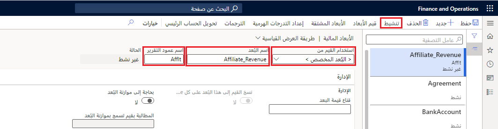
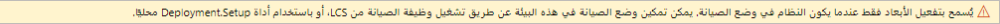

[!INCLUDE]
[!INCLUDE]

## خطوات المعمل

1. في صفحة Finance and Operations الرئيسية، أعلى اليسار، تحقق من أنك تعمل مع شركة USMF.

2. إذا لزم الأمر، حدد الشركة، ومن القائمة، حدد **USMF**.

3. في جزء التنقل الأيمن، حدد **الوحدات النمطية** > **دفتر الأستاذ العام** > **جدول الحسابات** > **الأبعاد** > **الأبعاد المالية**.

4. في القائمة العلوية، حدد **+ جديد**.

5. في صفحة الأبعاد المالية، حدد القائمة **استخدام القيم من**، ثم حدد **<بُعد مخصص>**.

6. في مربع الاسم **البُعد**، أدخل **Affliate_Revenue**.

7. في المربع **الإبلاغ عن اسم العمود**، أدخل **Afflt**.

8. في القائمة العلوية، حدد **تنشيط**.

    > [!div class="mx-imgBorder"]
    > 

9. راجع المعلومات في مربع الحوار، ثم حدد **إغلاق**.

10. راجع شعار إعلام التحذير.

> [!div class="mx-imgBorder"]
> 

يمكن تشغيل وضع الصيانة وإيقاف تشغيله مباشرةً من خلال Lifecycle Services (LCS)‎ في بيئة الحماية وبيئات الإنتاج.

[!INCLUDE]
