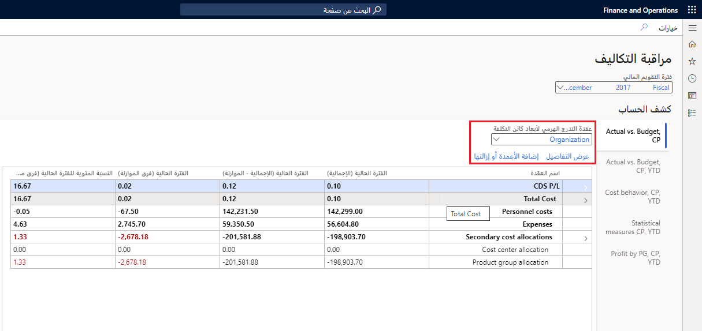
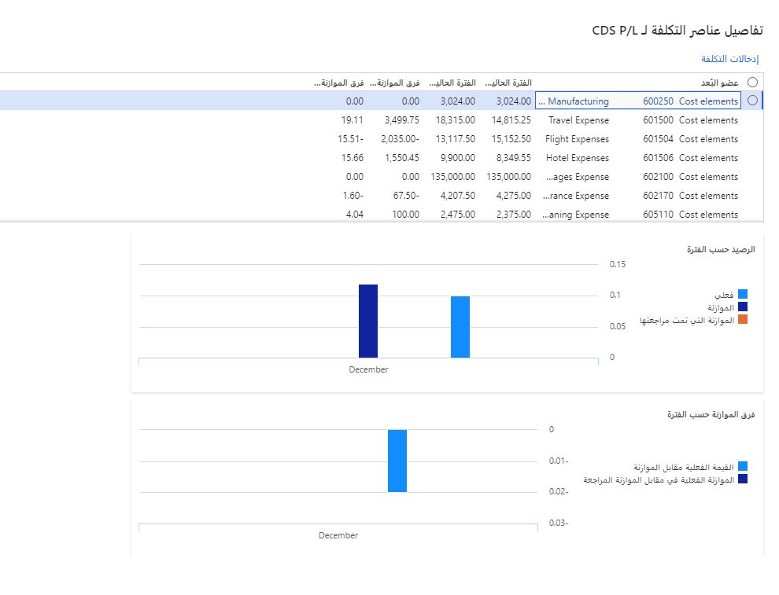
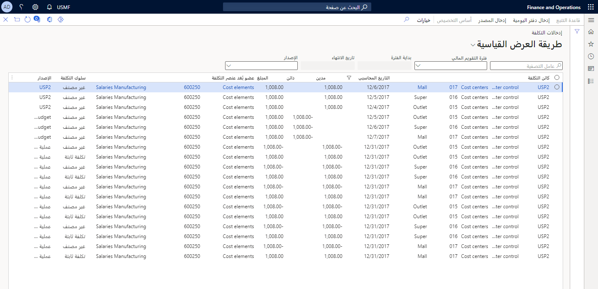

**محاسبة التكاليف** هي شكل من أشكال المحاسبة الإدارية التي تهدف إلى تحديد التكلفة الإجمالية للإنتاج للشركة من خلال تقييم التكاليف المتغيرة لكل خطوة من خطوات الإنتاج، بالإضافة إلى التكاليف الثابتة، مثل مصروفات الإيجار.

توفر محاسبة التكاليف في Finance رؤى مهمة حول كفاءة التكلفة وقدرة عمليات اتخاذ القرار الإداري. إنه يمكّن مراقبي التكلفة ومديري مراكز التكلفة من التحكم في تكاليف العمليات الحالية وتصنيفها وتخصيصها وتحليلها والتخطيط للتغييرات المستقبلية.

نظراً لأن محتوى تحليل محاسبة التكاليف يسلط الضوء على الفروق بين التكاليف الفعلية والتكاليف المدرجة في الموازنة، يمكن إخطار المديرين بالاتجاهات الإيجابية والسلبية لوحداتهم التشغيلية. يمكن للمديرين الانتقال إلى التدرجات الهرمية لعناصر التكلفة أو عناصر التكلفة الفردية. بهذه الطريقة، يمكن للمديرين الحصول على رؤية تفصيلية حول كيفية حدوث فروق التكاليف، ثم اتخاذ إجراءات فعالة.

تم تصميم **مساحة عمل مراقبة التكلفة** في **مراقبة التكلفة > محاسبة التكاليف** بحيث تكون صفحة. لذلك، يمكن منح حق الوصول لجميع المديرين المسؤولين عن كائن التكلفة. يمكنك التحكم في الوصول إلى الصفحة والبيانات الموجودة في النموذج.

تحكم في قائمة التقارير المتاحة للمستخدمين، مثل المديرين، عن طريق تعيين الخيار **منشور** في صفحة **تكوينات مساحة عمل مراقبة التكلفة**.

يمكن للمدير تحديد فترة التقويم المالي لعرضها. يتم استخدام تاريخ الجلسة لتحديد الفترة الحالية الافتراضية.

يتم تحديد القيم في فترة التقويم المالي حسب اسم التقرير والتقويم المالي المحدد لدفتر أستاذ محاسبة التكاليف المرتبط باسم التقرير في صفحة تكوينات مساحة عمل مراقبة التكلفة.

في التدرج الهرمي لأبعاد كائن التكلفة، يمكن للمستخدمين تحديد مستوى التجميع الذي يجب أن تظهر فيه الأرصدة. من خلال تمكين الأمان على مستوى الوصول، يمكنك التحكم في الأذونات حتى يتمكن المستخدمون من عرض التدرج الهرمي بأكمله. ومع ذلك، يمكن للمستخدمين فقط عرض أرصدة الرؤساء التنفيذيين، مثل الرئيس التنفيذي والمديرين الماليين، الذين تم منحهم حق الوصول.

يمكن للمستخدمين تخصيص الأعمدة في التقرير لتلائم متطلباتهم.

يمكن للمستخدمين التنقل في التفاصيل الموجودة خلف الأرصدة المعروضة في مساحة العمل. إذا حدد المستخدمون عقدة التدرج الهرمي لبعد عنصر التكلفة، ثم حددوا **عرض التفاصيل**، فسيعرض مربع الحوار **تفاصيل عنصر التكلفة** معلومات مفصلة للعقدة.

> [!div class="mx-imgBorder"]
> 

تعرض الشبكة كل عنصر تكلفة مقترن بعقدة التدرج الهرمي لبعد عنصر التكلفة وقيمها. تتوافق الأعمدة التي تظهر في الشبكة مع إعدادات مساحة العمل. يُظهر مخططان ملخصاً للفرق الفعلي في مقابل الموازنة وتباين الموازنة حسب الفترة.

> [!div class="mx-imgBorder"]
> 

يمكن للمستخدمين تحديد **إدخالات التكلفة** للتعمق في تفاصيل الإدخال كما هو مطلوب في **محاسبة التكاليف> التحكم في التكلفة> ...> عرض التفاصيل> إدخالات التكلفة**.

> [!div class="mx-imgBorder"]
> 

على سبيل المثال، الإيجار عبارة عن نفقات يتم توزيعها على مراكز التكلفة. يمكن للمستخدم الذي يريد فهم تكلفة الإيجار التي يجب أن يتحملها مركز التكلفة الخاص به أو بها التنقل لأسفل لعرض كيفية حساب الإيجار.

لمعرفة المزيد حول محاسبة التكاليف، قم بالوصول إلى الروابط المقابلة في وحدة **الملخص** في نهاية هذه الوحدة.

