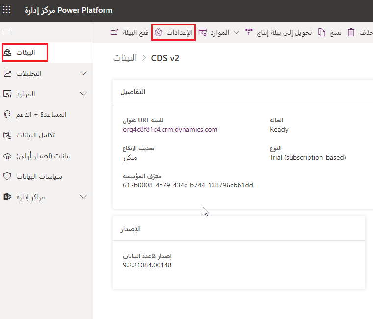
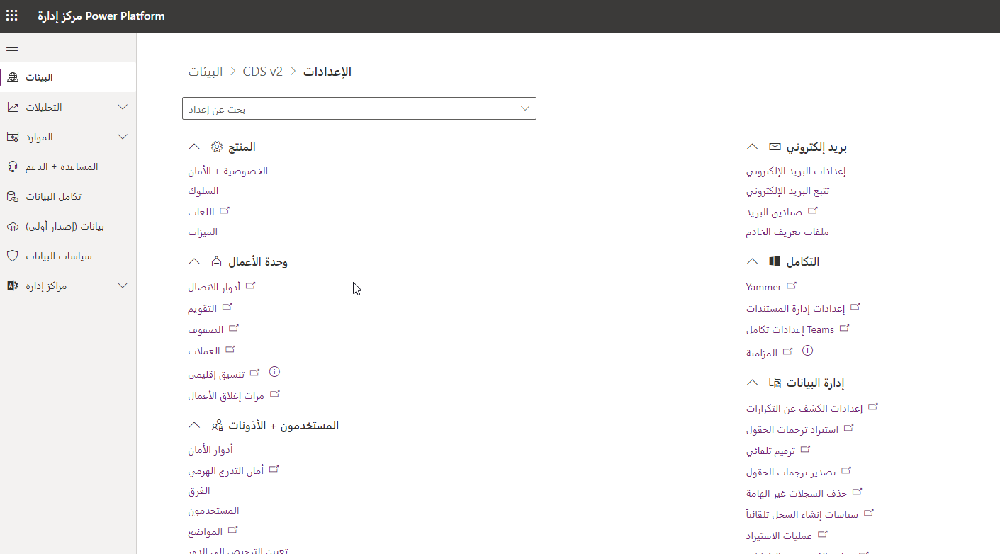
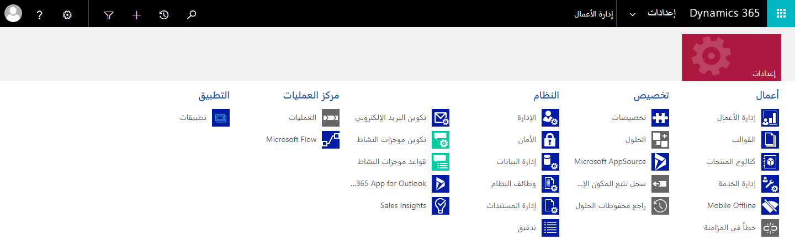

تتمثل الخطوة الأولى لبدء أي تكوين Power Platform أو تكوين Dynamics 365 في الوصول إلى "مركز إدارة **Power Platform"**. يوفر "مركز إدارة Power Platform" بوابة موحدة للمسؤولين لإدارة البيئات والإعدادات لـ Power Apps وPower Automate والتطبيقات المستندة إلى النموذج في Dynamics
365.

عند إنشاء بيئة Dynamics 365، تتوفر معظم إعدادات الإدارة التي ستحتاج إليها في "مركز إدارة Power Apps". يجب عليك دائمًا التحقق من إعدادات الإدارة كخطوة أولى عند البحث عن إدارة Microsoft Dataverse.

كما هو موضح في الشكل التالي، يتم تجميع الإعدادات في الفئات العامة التالية ويمكن الوصول إليها عن طريق تحديد الارتباط الموجود على الجانب الأيسر من المدخل.

-   **البيئات** - يسرد هذا القسم جميع حالات Common Data Service.

-   **سياسات البيانات** - يتيح لك هذا القسم إعداد سياسات لتقييد موصلات البيانات التي يمكن استخدامها مع Dataverse للحد من البيانات التي يمكن أن تتدفق إلى كيانات Dataverse أو خارجها.

-   **تكامل البيانات** - يتيح لك هذا القسم إنشاء اتصالات محددة مسبقًا أو إضافتها ومراقبة هذه الاتصالات بين Dataverse ومتاجر البيانات الأخرى مثل Salesforce أو SQL Server.

-   **المستأجر** - يتيح لك هذا القسم مراقبة التراخيص والحصص النسبية.

 يمكنك عرض الإعدادات وإدارتها لبيئاتك عن طريق تسجيل الدخول إلى "مركز إدارة Power Platform"، والانتقال إلى صفحة **البيئات**، وتحديد بيئة، ثم تحديد **الإعدادات**.

> [!div class="mx-imgBorder"]
> 

يمكن إدارة الإعدادات الخاصة بالبيئة المحددة هنا.

> [!div class="mx-imgBorder"]
> 

ستلاحظ أنه من "مركز إدارة Power Platform"، هناك مراكز إدارة إضافية متاحة للاستكشاف. أحد مراكز الإدارة هو "مركز إدارة Dynamics 365".

تنتقل إعدادات المسؤول تدريجيًا من "مركز إدارة Dynamics 365" إلى "مركز إدارة Power Platform". حتى اكتمال الانتقال إلى "مركز إدارة Power Platform"، ستظل قادرًا على إدارة الإعدادات في التطبيقات المستندة إلى النموذج في Dynamics 365، مثل Dynamics 365 Sales وCustomer Service. من المهم أن تكون على دراية بكلا مركزي الإدارة.

سيتم نقل العديد من الإعدادات التي تراها في قسم "الإعدادات" القديمة في Dynamics 365 (أدناه) إلى "مركز إدارة Power Platform".

> [!div class="mx-imgBorder"]
> 

ستظل الإعدادات الخاصة بالتطبيق في التطبيقات المستندة إلى النموذج في Dynamics 365 ويمكن الوصول إليها من خلال إعدادات التطبيق. 

في الوحدة التالية، سنتعلم كيفية استخدام "مركز إدارة Power Platform" لتشغيل تطبيق Dynamics 365 المستند إلى النموذج وتشغيله.
