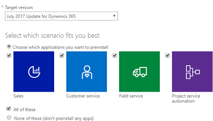

من "مركز إدارة Power Platform"، يمكنك تكوين التطبيقات المستندة إلى نموذج Dynamics 365 أعلى بيئتك الحالية. بإضافة تطبيق يستند إلى نموذج، ستضيف أحد **مثيلات** Dynamics 365. يمكنك إضافة مثيلات الإنتاج وغير الإنتاج (آلية تحديد الوصول) إلى أحد الاشتراكات. ينشئ كل مثيل جديد مؤسسة منفصلة يمكن استخدامها من قبل أقسام أو مواقع أو لأغراض غير إنتاجية مثل التطوير. لأغراض العرض التوضيحي، عادةً ما تكون بيئة "بيئة الاختبار المعزولة" هي الأفضل.

عند إضافة تطبيق يستند إلى نموذج، يكون خيارك الأول هو تحديد السيناريو الذي يناسبك بشكل أفضل. تعتمد التطبيقات التي يمكنك اختيارها على التراخيص التي اشتريتها.
حدد التطبيق المستند إلى النموذج الذي يلبي متطلبات شركتك.

> [!div class="mx-imgBorder"]
> 

من هناك، ستحتاج إلى ملء المعلومات التالية لتهيئة تطبيقك المستند إلى نموذج:

-   **الاسم**. عادةً ما يكون هذا هو اسم مؤسستك ويتم عرضه في التطبيقات المستندة إلى النموذج في Dynamics 365، مثل Dynamics 365 Sales وCustomer Service.

-   **عنوان URL**. يتم استخدام عنوان URL لإنشاء عنوان URL للمستخدمين لتسجيل الدخول إلى التطبيقات المستندة إلى النموذج في Dynamics 365. تجعل عناوين URL الأقصر تسجيل الدخول أكثر سهولة للمستخدمين.

-   **الغرض**. تُستخدم هذه القيمة لربط المثيل بهدف محدد ولا يتم عرضها إلا في "منتقي المثيل"، والذي يمكن الوصول إليه من خلال "مركز إدارة Dynamics 365". فمثلاً، إذا كان هذا المثال مخصصًا للاستخدام الحصري من قبل أقسام المبيعات والتسويق لديك، فيمكنك إدخال *Contoso Sales وMarketing* أو إذا كان المثيل مخصصًا للتطوير ولأغراض الاختبار، أدخل اسمًا ذا صلة مثل "تطوير *Contoso"*.

-   **مجموعة الأمان**. تُستخدم هذه القيمة لتحديد مجموعة أمان Microsoft Online Services التي تتضمن المستخدمين الذين سيتمكنون من الوصول إلى هذا المثيل.

-   **البلد / المنطقة**. يمكنك تحديد منطقة للمثيل.

-   **العملة**. عند إضافة مثيل، يجب عليك تحديد عملة أساسية قبل توفير المثيل. رغم أنه يمكنك إضافة عملات في التطبيقات المستندة إلى النموذج في Dynamics 365، سيتم استخدام العملة الأساسية فقط لإعداد التقارير. بمجرد التعيين، لا يمكن تغيير العملة الأساسية.

يمكنك التنقل عبر التطبيق، بمجرد تكوين تطبيق Dynamics 365 المستند إلى النموذج. هذا هو المكان الذي ستشاهد فيه تغييرات التكوين الخاصة بك بعد نشرها عبر مركز الإدارة.
