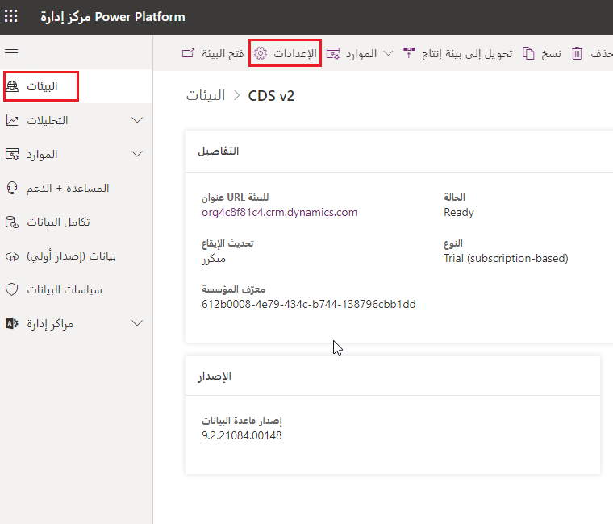

يبدأ تطور المؤسسة التي تتبنى Microsoft Dataverse والتطبيقات المستندة إلى نموذج Dynamics 365 بـ Power Platform مركز الإدارة. في هذا التمرين المعملي، سوف نستكشف مركز الإدارة ونتعرف على البيئات والإعدادات المتاحة للتكوين.

### الأهداف التعليمية
في نهاية هذا التمرين، ستكون قد انتقلت عبر مركز الإدارة Power Platform واستكشفت إعدادات البيئة. في نهاية المعمل سنضيف عملة جديدة إلى بيئة Dataverse.

### الخطوات عالية المستوى
1. قم بالوصول إلى Power Platform مركز الإدارة.
2. استكشاف البيئات.
3. تحديد إعدادات البيئة الرئيسية.
4. أضف عملة جديدة إلى بيئة Dataverse. 

### الخطوات التفصيلية 
أنت مسؤول Dynamics 365 و Power Platform جديد لمؤسسة. لديهم بيئة Dataverse منتشرة حالياً.. لقد بدأوا مؤخراً ممارسة الأعمال التجارية في منطقة جغرافية جديدة وتحتاج إلى إضافة العملة الجديدة إلى بيئتهم. هذه هي المرة الأولى التي تقوم فيها بتسجيل الدخول إلى مركز الإدارة Power Platform الخاص بهم، لذا فأنت تريد التعرف على نشرهم قبل تغيير الإعداد.

1.  قم بتسجيل الدخول إلى [Power Platform مركز الإدارة](https://admin.powerplatform.microsoft.com/).

2.  استكشف البيئات في Power Platform مركز الإدارة الخاص بك بالنقر فوق **البيئة** في القائمة اليمنى.

    -   عرض البيئات المتاحة، بما في ذلك البيئة الافتراضية.
    -   تدرب على تبديل البيئات باستخدام القائمة المنسدلة في القائمة العلوية لتغيير البيئة.

3.  حدد إحدى البيئات وافتحها.

    > [!div class="mx-imgBorder"]
    > 

4.  حدد **إعدادات**. كشف الإعدادات المتاحة للتهيئة في مركز الإدارة Power Platform.

    -   انقر فوق الإعدادات المتنوعة من مقاطع البيئة والمنتج والاعمال. استكشف الإعدادات المتوفرة للتكوين.

    > [!div class="mx-imgBorder"]
    > 

5.  قم بتغيير البيئة **العملة**.

    -   انتقل إلى **الإعدادات** > **الأعمال**.

    -   انقر فوق **العملات**.

    -   انقر فوق **جديد**.

    -   املأ المعلومات كما هو مطلوب.

        | **الحقل**               | **الوصف**                                                                                                                                                                                                                                                                                                                                                                                                                                                                                                                                                                                                                    |
        |-------------------------|------------------------------------------------------------------------------------------------------------------------------------------------------------------------------------------------------------------------------------------------------------------------------------------------------------------------------------------------------------------------------------------------------------------------------------------------------------------------------------------------------------------------------------------------------------------------------------------------------------------------------------|
        | **نوع العملة**       | حدد **النظام** إذا كنت تريد استخدام العملات المتوفرة في التطبيقات المستندة إلى نموذج في Dynamics 365. للبحث عن عملة، انقر فوق الزر **بحث** بجوار **كود العملة**. عند تحديد رمز العملة، تتم إضافة، **اسم العملة** و **Currency Symbol** تلقائياً للعملة المحددة. حدد **تخصيص** إذا كنت تريد إضافة عملة جديدة وتكوينها. في هذا التمرين، حدد **قياسي**.                                                                                                                                                                                                                                                                                              
        | **‏‏كود العملة**       | نموذج مختصر للعملة. على سبيل المثال، **USD** للدولار الأمريكي.                                                                                                                                                                                                                                                                                                                                                                                                                                                                                                                                                    |
        | **دقة العملة**  | اكتب عدد الكسور العشرية التي تريد استخدامها للعملة. يمكنك إضافة قيمة بين 0 و4. إذا قمت بتعيين قيمة دقة في مربع الحوار **إعدادات النظام** فستظهر هذه القيمة هنا..                                                                                                                                                                                                                                                                                                                                                                                                              |
        | **اسم العملة**       | إذا قمت بتحديد رمز عملة من قائمة العملات المتوفرة في التطبيقات المستندة إلى نموذج في Dynamics 365، فسيتم عرض اسم العملة للرمز المحدد هنا. إذا حددت **مخصص** كنوع العملة، فاكتب اسم العملة.                                                                                                                                                                                                                                                                                                                                                                             |
        | **رمز العملة**     | إذا قمت بتحديد رمز عملة من قائمة العملات المتاحة، فسيتم عرض رمز العملة المحددة هنا. إذا حددت **مخصص** كنوع العملة، أدخل رمز العملة الجديدة.                                                                                                                                                                                                                                                                                                                                                                                                             |
        | **تحويل العملات** | اكتب قيمة العملة المحددة بدولار أمريكي واحد. هذا هو المبلغ الذي يتم تحويل العملة المحددة عنده إلى العملة الأساسية. تأكد من تحديث هذه القيمة بشكل متكرر كما هو مطلوب لتجنب أي حسابات غير دقيقة في معاملاتك.                                                                                                                                                                                                                                                                                                                                            |

6.  عند الانتهاء، في شريط الأوامر، انقر فوق **حفظ** أو **حفظ وإغلاق**.
