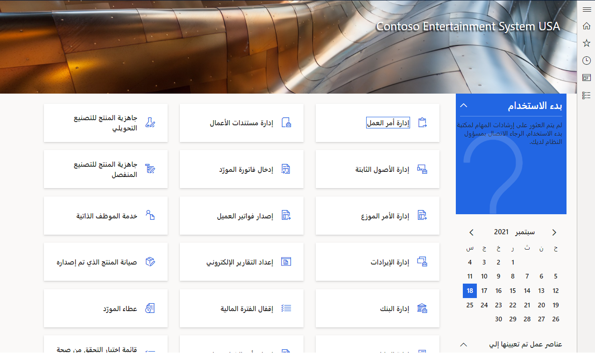
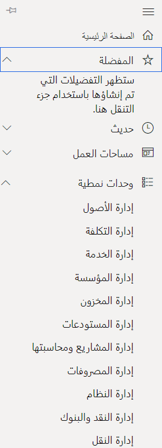
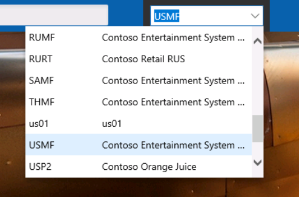

#### تسجيل الدخول

تعتمد تطبيقات Dynamics 365 على المستعرض، لتحقيق أقصى قدر من قابلية النقل والتكيف مع أي جهاز. يمكنك تسجيل الدخول إلى النظام عن طريق فتح متصفح (يتم سرد المتصفحات والأجهزة المدعومة هنا: [متصفحات الويب والأجهزة المحمولة المدعومة](/dynamics365/customerengagement/on-premises/admin/supported-web-browsers-and-mobile-devices) ) وتسجيل الدخول باستخدام معرّف Azure Active Directory الخاص بك.

> [!div class="mx-imgBorder"]
> 

#### أشرطة الأدوات

لاحظ أشرطة الأدوات على الجانب الأيمن. إنها مخصصة للمفضلة والحديثة ومساحات العمل والوحدات النمطية.

> [!div class="mx-imgBorder"]
> 

-   يمكنك إضافة نموذج أو تقرير في قائمة إلى مفضلاتك، ببساطة عن طريق تحريك الماوس بالقرب من عنصر القائمة، واختيار النجمة التي تظهر على يمين الاسم. سيتم إدراجها ضمن **المفضلة** في قائمتك.

-   سيعرض القسم **الأحدث** أصناف القائمة التي حددتها مؤخرًا.

-   تتم محاذاة **أماكن العمل** مع الأدوار وتبسيط الوظائف، مع الكثير من مؤشرات الأداء الرئيسية المرئية والأصناف الشائعة سهلة التحديد.

-   تم استخدام **الوحدات النمطية** في الإصدارات السابقة من البرنامج.

#### الكيان القانوني

لاحظ أنه عادةً ما تقوم بتسجيل الدخول إلى شركة DAT. يمكنك بسهولة تغيير الكيان القانوني الذي أنت فيه. انقر في الحقل **DAT** وحدد الكيان القانوني الذي تريده من القائمة المنسدلة المعروضة.

> [!div class="mx-imgBorder"]
> 
