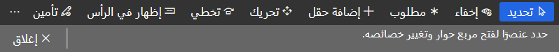

في Dynamics 365، تُستخدم كلمة *التخصيص* للإشارة إلى التغييرات غير البرمجية في النظام، وخاصة في واجهة المستخدم. ينطبق بشكل خاص على المستخدمين الفرديين. عادةً ما تشير الكلمة *التخصيص* إلى رمز مكتوب بواسطة مطور، وعادةً لجميع المستخدمين. هذه ليست قاعدة صارمة وسريعة، ويمكن وضعها بخلاف ذلك. على سبيل المثال، يمكن تطبيق التخصيصات على عدة مستخدمين (على سبيل المثال، جميع المستخدمين في دور معين).

#### تغيير شركتك الافتراضية

في وقت سابق، ناقشنا تغيير الشركة التي تم تسجيل الدخول إليها حالياً. ماذا لو أردنا تغيير الإعداد الافتراضي إلى تلك الشركة، بحيث لا نحتاج إلى تغييره في كل مرة نقوم فيها بتسجيل الدخول؟

يمكنك أيضاً تغيير شركتك الافتراضية: حدد رمز الترس في الجزء العلوي الأيسر من شاشتك، وحدد خيارات المستخدم.

> [!div class="mx-imgBorder"]
> 

في شاشة الخيارات، حدد علامة التبويب التفضيلات وقم بتغيير شركة بدء التشغيل.

> [!div class="mx-imgBorder"]
> 

#### نموذج خيارات المستخدم

في هذا النموذج، لديك العديد من الخيارات لتخصيص تجربة المستخدم:

-   الإعدادات المرئية

    -   نسق الألوان

    -   الحجم

-   التفضيلات

    -   البدء

        -   الشركة

        -   وضع العرض/التحرير الافتراضي

        -   الصفحة الأولية

    -   تفضيلات البلد/المنطقة واللغة

        -   اللغة

        -   المنطقة الزمنية

        -   تنسيق الأرقام والتاريخ والوقت

        -   البلد/المنطقة

    -   متنوع

        -   تم تمكين معالجة المستندات نعم / لا

        -   معالجة عناوين URL: تحديث معلمة الاستعلام Y / N تلقائياً

    -   إمكانية الوصول

        -   تسلسل علامات التبويب المحسنة Y / N

-   الحساب

    -   الحساب

        -   معرف المستخدم (العرض فقط، لا تعديل)

        -   مجال الشبكة (عرض فقط، بدون تعديل)

        -   الاسم

        -   معرف قياس تتبع الاستخدام (العرض فقط، بدون تحرير)

        -   الاسم المستعار (عرض فقط، بدون تحرير)

    -   تحديد موفر البريد الإلكتروني

        -   معرّف موفر البريد الإلكتروني

        -   البريد الإلكتروني - يُستخدم هذا في الإخطارات ومعالجة المستندات

    -   توقيع إلكتروني

        -   تمكين التوقيع نعم/لا

        -   شهادة صالحة نعم / لا

        -   توجد أيضاً أزرار لتعيين جهة اعتماد والحصول على شهادة

-   سير العمل

    -   الإخطارات

        -   إرسال إشعارات بالبريد الإلكتروني نعم / لا

        -   نوع إخطار سير عمل الصنف (إخطارات فردية أو مجمعة)

    -   تفويض

        -   هنا يمكن إضافة المفوضين وإزالتهم

#### تخصيص النموذج

يتم إطلاق تخصيص النموذج من مكانين:

-   من أي نموذج في واجهة المستخدم: انقر بزر الماوس الأيمن في حقل أو شبكة وحدد *تخصيص*.

    > [!div class="mx-imgBorder"]
    > 

    ستسمح لك النافذة المنبثقة الناتجة بما يلي:

    -   إخفاء (الحقل)

    -   تضمين في مخلص علامة تبويب سريعة

    -   تخطي في تسلسل مفتاح Tab

    -   إضفاء الطابع الشخصي على هذا النموذج

    يمنحك الخيار الأخير العديد من الخيارات، بما في ذلك خيار لإضافة حقول إلى النموذج.

    > [!div class="mx-imgBorder"]
    > 

-   من علامة التبويب "الخيارات" (قد تحتاج إلى تحديد علامة الحذف ... لرؤيته) حدد تخصيص هذا النموذج

    > [!div class="mx-imgBorder"]
    > 

    > [!div class="mx-imgBorder"]
    > 