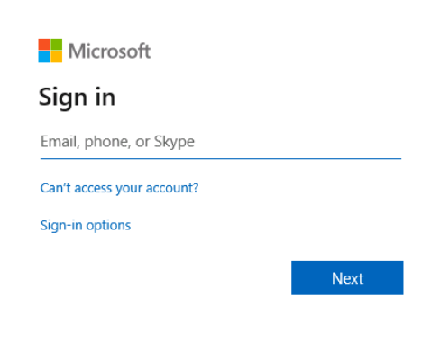
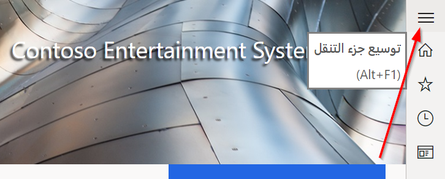
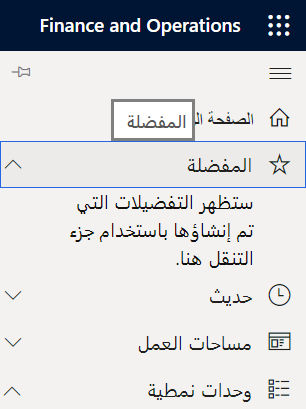
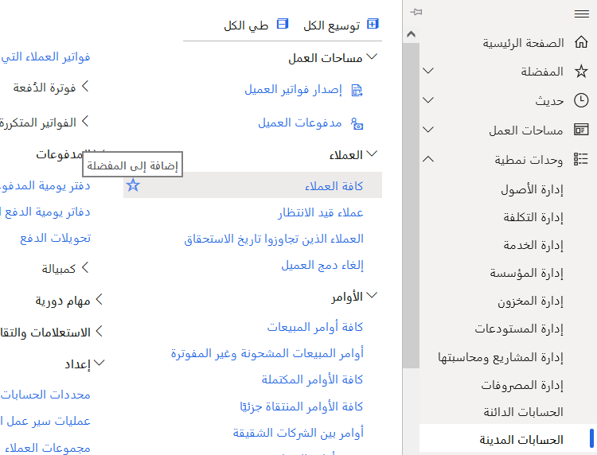
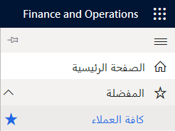

1.  فتح المستعرض

2.  تسجيل الدخول إلى بيئتك

    > [!div class="mx-imgBorder"]
    > 

3.  على الجانب الأيسر، حدد الشفرات

    > [!div class="mx-imgBorder"]
    > 

4.  توسيع المفضلة وشاهد ما هو متاح

    > [!div class="mx-imgBorder"]
    > 

5.  ضمن الوحدات النمطية، حدد الحسابات المدينة

6.  افتح "العملاء"، وقم بتمرير الماوس فوق "كل العملاء"، وحدد النجمة لـ "الإضافة إلى المفضلة"

    > [!div class="mx-imgBorder"]
    > 

7.  الرجوع إلى قائمة المفضلة والاطلاع على قائمة "جميع العملاء"

    > [!div class="mx-imgBorder"]
    > 

8.  كرر مع أي أصناف قائمة أخرى (النماذج والتقارير والوظائف) التي تريد العودة إليها بشكل متكرر
