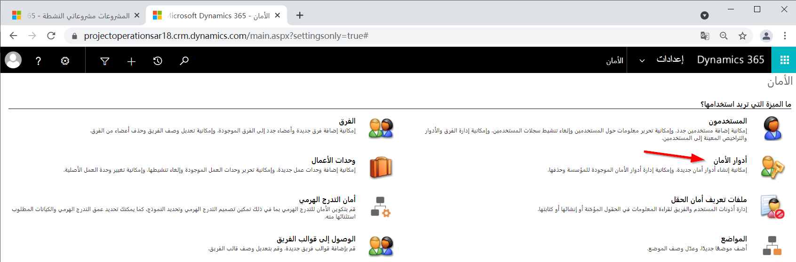
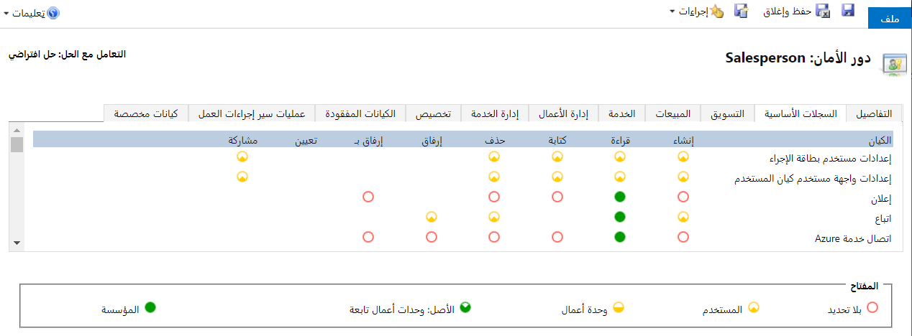

يستند نموذج الأمان في Power Platform و Dynamics 365 على الدور، مما يعني أن النموذج يركز على تجميع مجموعة من الامتيازات معاً التي تصف المسؤوليات (أو المهام التي يمكن تنفيذها) للمستخدم. عندما تقوم بإعداد أدوار الأمان في تطبيق يستند إلى نموذج Dynamics 365، يمكنك تقييد الوصول بحيث يكون لدى المستخدمين المعلومات التي يحتاجونها فقط لأداء دورهم، ولا شيء أكثر من ذلك. 

يمكن التحكم في أمان تطبيق Dynamics 365 المستند إلى نموذج في قسم **الأمان** قسم **الإعدات**.

> [!div class="mx-imgBorder"]
> 

يتكون نموذج الأمان Power Platform وDynamics 365 في جوهره من مبدأين أساسيين: **الامتيازات** و **مستويات الوصول**. عند تكوينه جنباً إلى جنب، يمكن للمسؤول التحكم في أمان المستخدم عبر بيئة تطبيق Dynamics 365 المستندة إلى نموذج.

## الامتيازات

الامتياز هو إذن لتنفيذ إجراء في Dynamics 365. Power Apps تستخدم والتطبيقات المستندة إلى نموذج امتيازات مختلفة على مستوى السجل تحدد مستوى وصول المستخدم إلى سجل أو نوع سجل معين.

| **الامتياز** | **الوصف**                                                                                                                                                                                                                                                                                                                                                                                         |
|---------------|---------------------------------------------------------------------------------------------------------------------------------------------------------------------------------------------------------------------------------------------------------------------------------------------------------------------------------------------------------------------------------------------------------|
| **إنشاء**    | مطلوب لإنشاء سجل جديد.                                                                                                                                                                                                                                                                |
| **قراءة**      | مطلوب لفتح سجل لعرض المحتويات.                                                                                                                                                                                                                                                       |
| **الكتابة**     | مطلوب لإجراء تغييرات على أحد السجلات.                                                                                                                                                                                                                                                             |
| **حذف**    | مطلوب لإزالة سجل نهائياً.                                                                                                                                                                                                                                                             |
| **إلحاق**    | مطلوب لإقران السجل الحالي بسجل آخر. على سبيل المثال، يمكن إرفاق ملاحظة بفرصة إذا كان لدى المستخدم حقوق إلحاق بالملاحظة. في حالة علاقات أطراف بأطراف، يجب أن يكون لديك امتياز إلحاق لكلا الكيانين المرتبطين أو غير المرتبطين. |
| **إلحاق بـ** | مطلوب لإقران سجل بالسجل الحالي. على سبيل المثال، إذا كان لدى المستخدم حقوق "إلحاق بـ" في إحدى الفرص، فيمكن للمستخدم إضافة ملاحظة إلى الفرصة.                                                                                                                      |
| **تعيين**    | مطلوب لمنح ملكية سجل إلى مستخدم آخر.                                                                                                                                                                                                                                            |
| **مشاركة**     | مطلوب لمنح حق الوصول إلى سجل لمستخدم آخر مع الاحتفاظ بحق الوصول الخاص بك.                                                                                                                                                                                                                     |

يمكن لمالك السجل أو الشخص الذي لديه امتياز المشاركة في سجل مشاركة سجل مع مستخدمين أو فرق أخرى. يمكن أن تضيف المشاركة امتيازات القراءة والكتابة والحذف والإلحاق والتعيين والمشاركة لسجلات معينة.

## مستويات الوصول

يحدد مستوى الوصول، لنوع كيان معين، المستويات الموجودة داخل التدرج الهرمي للمؤسسة التي يمكن للمستخدم أن يعمل على هذا النوع من الكيان.

يدرج ما يلي قائمة بمستويات الوصول في تطبيقات Dynamics 365 المستندة إلى نموذج، بدءاً من أقصى وصول.

|  |  |   
| ----| -----|  
|  |**عمومي.** يمنح مستوى الوصول هذا المستخدم حق الوصول إلى جميع السجلات في المؤسسة، بغض النظر عن المستوى الهرمي لوحدة الأعمال التي ينتمي إليها المثيل أو المستخدم. المستخدمون الذين لديهم وصول عمومي لديهم وصول عميق ومحلي وأساسي أيضاً. نظراً لأن مستوى الوصول هذا يتيح الوصول إلى المعلومات في جميع أنحاء المؤسسة، فيجب تقييدها لمطابقة خطة أمان بيانات المؤسسة. عادة ما يكون هذا المستوى من الوصول محجوزاً للمديرين الذين لديهم سلطة على المؤسسة. يشير التطبيق إلى مستوى الوصول هذا باسم **مؤسسة**.| 
| |**عميق.** يمنح مستوى الوصول هذا المستخدم حق الوصول إلى السجلات في وحدة أعماله وجميع وحدات الأعمال التابعة لوحدة أعماله. المستخدمون الذين لديهم وصول عميق لديهم وصول محلي وأساسي أيضاً. نظراً لأن مستوى الوصول هذا يتيح الوصول إلى المعلومات عبر وحدة الأعمال ووحدات الأعمال التابعة، فيجب تقييدها لمطابقة خطة أمان البيانات الخاصة بالمؤسسة. عادة ما يكون هذا المستوى من الوصول محجوزاً للمديرين الذين لديهم سلطة على وحدات الأعمال. يشير التطبيق إلى مستوى الوصول هذا على أنه **الأصل: وحدات عمل تابعة**.|
||**محلي.** يمنح مستوى الوصول هذا المستخدم حق الوصول إلى السجلات في وحدة الأعمال الخاصة بالمستخدم. المستخدمون الذين لديهم وصول محلي لديهم حق الوصول الأساسي تلقائياً أيضاً. نظراً لأن مستوى الوصول هذا يتيح الوصول إلى المعلومات في جميع أنحاء وحدة الأعمال، فيجب تقييدها لتطابق خطة أمان بيانات المؤسسة. عادةً ما يكون مستوى الوصول هذا محجوزاً للمديرين الذين لديهم سلطة على وحدة الأعمال. يشير التطبيق إلى مستوى الوصول هذا على أنه **وحدة أعمال**.|
||**أساسي**. يمنح مستوى الوصول هذا المستخدم حق الوصول إلى السجلات التي يمتلكها المستخدم، والكائنات التي تتم مشاركتها مع المستخدم، والكائنات التي تتم مشاركتها مع فريق يكون المستخدم عضواً فيه. هذا هو المستوى المعتاد للوصول لممثلي المبيعات والخدمة. يشير التطبيق إلى مستوى الوصول هذا باسم **مستخدم**.|
||**لا شيء.** غير مسموح بالوصول.|

## تكوين دور أمان

تجربة المستخدم في التطبيق هي النتيجة المجمعة لأدوار الأمان المحددة وعضويات الفريق بالإضافة إلى تراخيص التطبيق. يمكن أن يؤدي استخدام أدوار الأمان لتقييد وصول المستخدم إلى السجلات إلى تحسين تجربته داخل التطبيق عن طريق إزالة الفوضى التي لا تعد جزءاً من متطلباتهم.

يتم منح المستخدمين حق الوصول والامتيازات على مستوى الكيان. لا يمكن منح الوصول إلى السجلات الفردية على وجه التحديد. إذا كانت الأدوار المجمعة للمستخدم لا تسمح بالوصول إلى سجل، أو القدرة على تنفيذ الإجراءات مع السجل (مثل القراءة، والكتابة، والإلحاق، وما إلى ذلك)، فلن يتمكن المستخدم من العمل مع السجلات خارج نطاق الأدوار المحددة. يحتاج جميع مستخدمي التطبيق إلى دور أمان واحد على الأقل يتم تعيينه للوصول إلى التطبيق، وهو دور تم تعيينه إما لمستخدمهم أو عن طريق عضويتهم في الفريق.

يُظهر الرسم التالي أدوار الأمان لبائع. سيؤدي النقر فوق كل دائرة فردية في عمود الامتيازات إلى تغيير مستوى الوصول.

> [!div class="mx-imgBorder"]
> 

