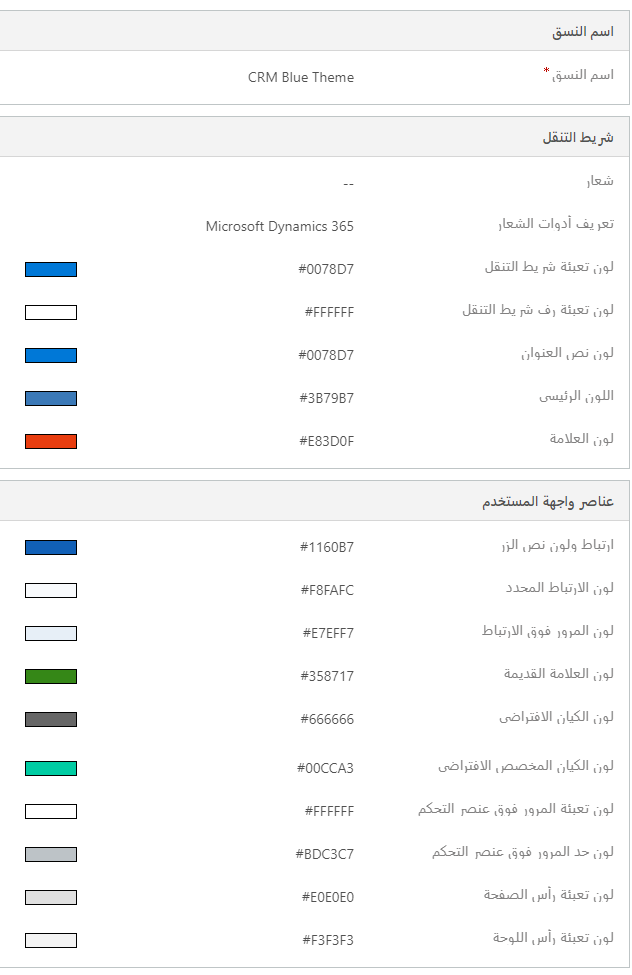
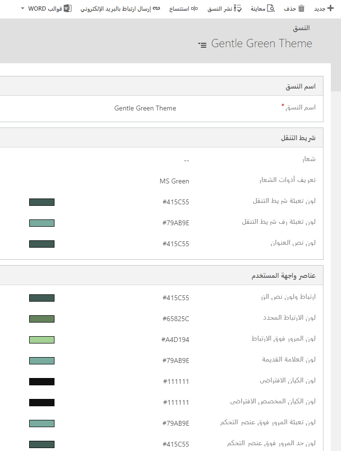
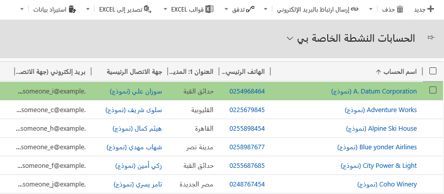

إذا لم تكن قد قمت بذلك بالفعل، فمن المفيد أن تتعرف على كلّ من أقسام **الإعدادات** في مركز مسؤولي Power Platform وتطبيق Dynamics 365 المستند إلى النموذج. يمكن أن يؤدي تخصيص هذه الإعدادات إلى تغيير تجربة المستخدم لتتوافق بشكل أكبر مع متطلبات العمل الخاصة بمؤسستك.

## النُسق

عن طريق إجراء تغييرات على الألوان الافتراضية والأصناف المرئية المتوفرة في النظام غير المخصص، يمكنك إنشاء شكل ومظهر مخصصين لتطبيقك. يعتبر تغيير **النسق** هي طريقة بسيطة نسبيًا لوضع علامة تجارية للتطبيق المستند إلى نموذج لمطابقة العلامة التجارية للمؤسسة.
يتم إنشاء سمة باستخدام أدوات التخصيص في واجهة المستخدم، دون الحاجة إلى مطور لكتابة تعليمات برمجية. يمكنك إنشاء السمات المستخدمة في مؤسستك أو تغييرها أو حذفها. يمكنك تحديد سمات متعددة، ولكن يمكن تعيين واحده فقط ونشرها كالسمة الافتراضية.

يتم استخدام التصميم لتحسين واجهة مستخدم التطبيق، وليس تغييرها بشكل جذري. يتم استخدام ألوان السمات في جميع أنحاء العالم خلال مرحلة التطبيق. على سبيل المثال، يمكنك تحسين العناصر المرئية التالية في واجهة المستخدم:

-   تغيير شعارات المنتج وألوان التنقل لإنشاء علامة تجارية للمنتج

-   ضبط ألوان التمييز، مثل ألوان التحويم أو التحديد

-   توفير الألوان الخاصة بالكيان

-   الشعار

-   تلميح أداة الشعار

-   لون شريط التنقل

-   لون رف شريط التنقل

-   لون شريط الأوامر الرئيسي على الواجهة الموحّدة

-   لون الرأس

الطريقة الأسهل والأسرع لإنشاء سمة جديدة هي استنساخ سمة موجودة وتعديلها، ثم حفظها ومعاينتها ونشرها.

1.  انتقل إلى **الإعدادات > التخصيصات**.

2.  حدد **السمات** ثم حدد **السمة الافتراضية من Dynamics 365**.

تُظهر لقطة الشاشة التالية إعداد السمة الافتراضي.

> [!div class="mx-imgBorder"]
> 

من هنا، يمكنك استنساخ النسق الافتراضي وتغيير الألوان. يمكنك أيضًا اختيار شعار جديد للمنتج.
تُظهر لقطة الشاشة التالية لون التنقل الجديد.

> [!div class="mx-imgBorder"]
> 

يمكنك معاينة السمة قبل نشرها. تُظهر لقطة الشاشة التالية شبكة كيان الحساب بلون التمييز الجديد بعد النشر.

> [!div class="mx-imgBorder"]
> 

## إضافة عينة بيانات أو إزالتها 

يمكن أن تساعد العميل في تصور الشكل الذي سيبدو عليه التطبيق المستند إلى النموذج في الإنتاج، وتمنحك البيانات النموذجية شيئًا لتجربته بينما تتعلم التطبيقات المستندة إلى نموذج في Dynamics 365.

إذا لم يتم تثبيت نموذج البيانات على نظامك، فقد ترغب في إضافته لأغراض العرض والتدريب. في وقت لاحق، عندما تكون جاهزًا، يمكنك إزالته.

1.  انتقل إلى **الإعدادات** > **إدارة البيانات**.

2.  انقر فوق **عينات البيانات**. سترى رسالة تخبرك بما إذا كان نموذج البيانات مثبت حالياً أو لا.

3.  قم بأحد الإجراءات التالية:

    -   انقر فوق **إزالة نموذج البيانات**، ثم انقر فوق **إغلاق**.

    -   انقر فوق **تثبيت نموذج البيانات**، ثم انقر فوق **إغلاق**.

